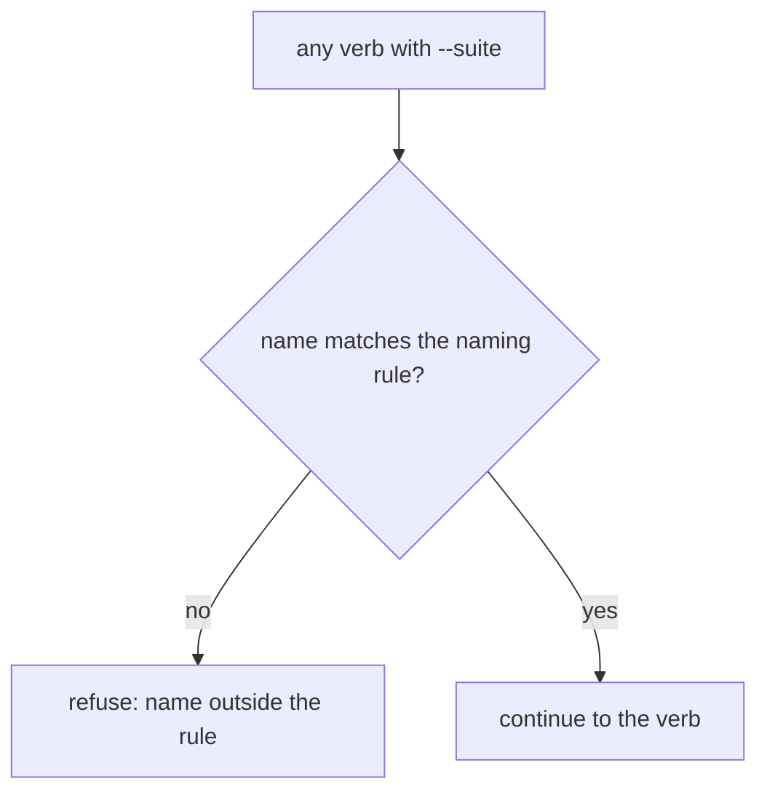
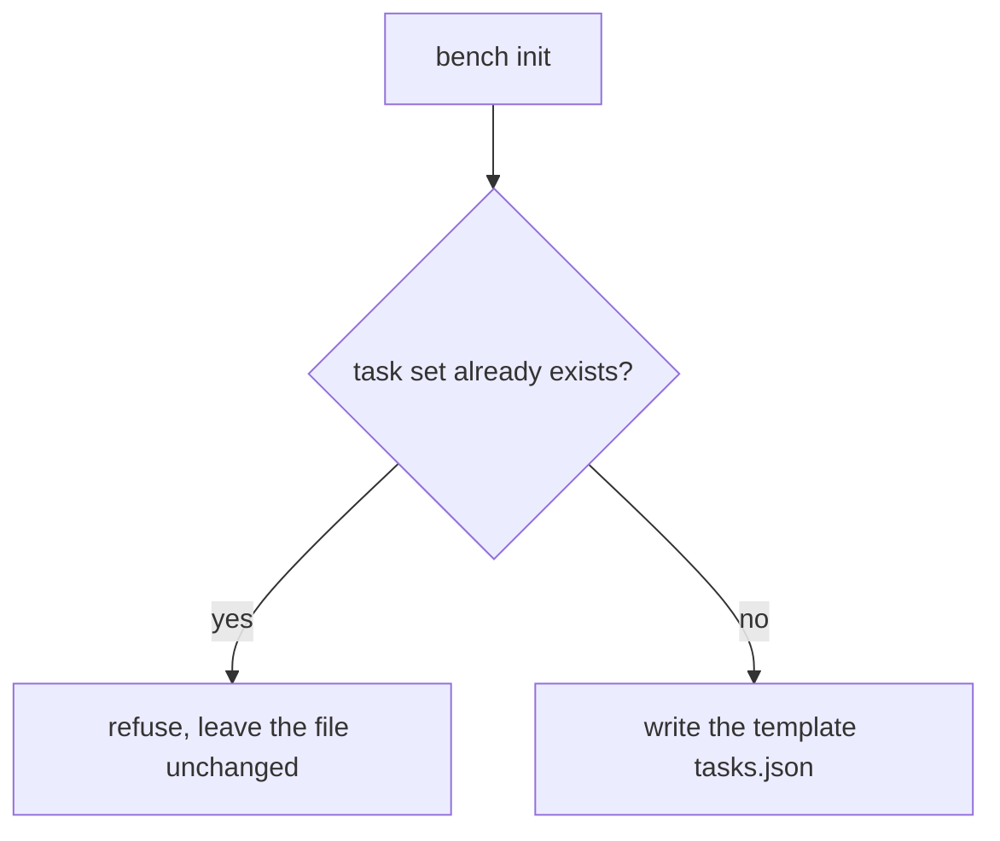
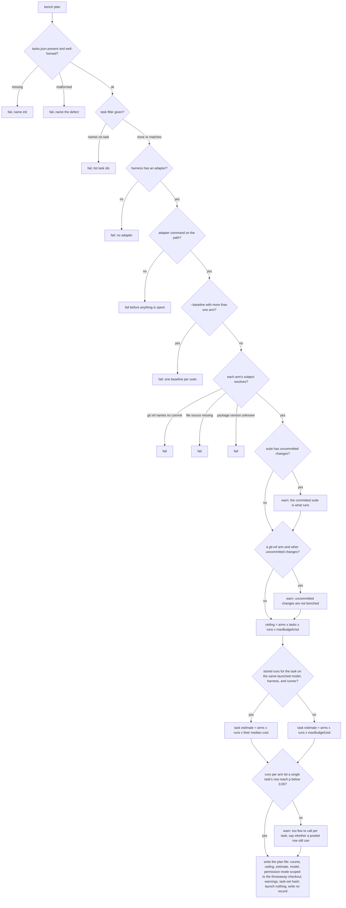
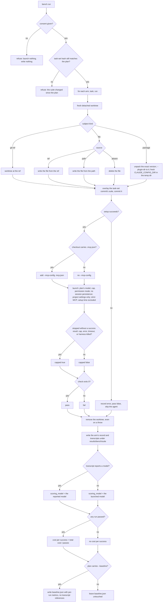
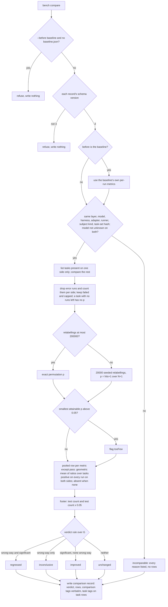

# engine — run a task set for real and compare two arms

The deterministic engine of the measured layer. It plans a measured run without spending, runs
**arms × tasks × N** real headless harness sessions in throwaway checkouts, grades each run with a
shell `check`, records what the harness counted, and compares two arms with permutation tests.

## What

ACED's simulated layers say what an agent *would* do. They cannot say whether a change makes real
work pass more often, take fewer turns, or burn fewer tokens, and they carry no statistics to tell a
real effect from run-to-run noise. This engine answers that. It is a port of repobuddy's
`agent-readiness bench`, generalized in two ways: the thing being
measured can be a git ref, a package version, or one swapped file, and the harness is reached
through an adapter (Claude Code first).

It ships as `.mts` scripts under `plugins/aced/skills/bench/scripts/` with a
published bin, so a consumer tool or a CI job can call it without the plugin installed. Its output is asserted, not graded, so under ACED fit it is **wrong-squad**: ACED recuses,
and the SDD-default chain builds it and verifies every scenario below with `node:test`, using a
stand-in harness binary on the `PATH` that appends its argv and selected environment to a log file
and replays a scripted transcript.

**Non-goals** — deciding whether a subject is worth measuring (the `measured` fit axis,
`../../../design/fit.md`); asking a person for consent and explaining results (`../skill/`); grading a
run with an LLM judge (a judged real run is #64's territory); `compare`'s and `report`'s measured
views (`../../compare/`, `../../report/`); `check-freshness` reading measured records — the
`evaluated` set is written in that engine's entry shape so a later additive change on
`../../check-freshness/` can read it, but today it matches records by `target` and a measured record
carries none; an interactive runner (dropped from v1); fanning out over a model matrix (a separate
change); interpreting comparison tags (the consumer owns their meaning).

**Key terms**

| Term | Meaning |
|---|---|
| **suite** | A named task set at `.agents/aced/bench/<suite>/` — `tasks.json`, the `checks/` it calls, and optionally a committed `baseline.json`. Names follow `^[a-z0-9]+(?:[-.][a-z0-9]+)*$`, so an owner can prefix with a dot (`<owner>.<name>`). |
| **task set** (`tasks.json`) | Suite-wide fields, each with a default: `model` (`sonnet`), `runs` per arm (3), `maxBudgetUsd` per run (0.50), `permissionMode` (`bypassPermissions`), `timeoutMinutes` per run (20, fractions allowed), optional `setup`. Then `tasks[]`, each `{ id, prompt, check, setup?, tags? }`; ids are unique, `prompt` and `check` required, at least one task. |
| **task-set commit** | The HEAD commit at plan time. Its committed `tasks.json` and `checks/` are what every run uses, whatever commit the arm checks out. |
| **task-set hash** | SHA-256 over the task-set commit's `tasks.json` and every file under `checks/`, path-sorted. A changed check changes the hash. |
| **arm** | A labelled subject — the thing whose effect is measured. A comparison has two arms (`before`/`after`, or `without`/`with`). Written `--arm <label>=<subject>`. |
| **subject** | One of three kinds, written and recorded as: `git:<ref>` → `{ kind: git-ref, ref, commit }`; `package:<name>@<version>` → `{ kind: package, name, version }`; `file:<path>=ref:<ref>`, `file:<path>=path:<source>`, or `file:<path>=absent` → `{ kind: file, path, from }`. |
| **adapter** | The harness-specific half: prepare the checkout's harness config, launch headless, parse the transcript into counts. Claude Code is the only adapter in v1. Its launch facts come from `@cyberuni/agent-harness`'s `headless()` fact. |
| **runner** | How the adapter drives the harness. v1 has one, `print` (headless `-p`); the field exists so records from another runner never compare silently. |
| **plan** | A JSON file `bench plan --out <file>` writes and `bench run --plan <file>` reads: counts, ceiling, estimate, model, permission mode, warnings, the arms, and the task-set hash. |
| **run record** | One arm's results: every run's metrics plus a summary, written as JSON. Schema version 3 — the first version this engine writes, and the only one it reads. A record from any other tool is converted by that tool, never read here. |
| **comparison record** | The statistics between two run records, plus a verdict and any caller tags. |
| **ceiling** | The most a measured run can spend: arms × tasks × runs × `maxBudgetUsd`. |
| **too few** | A row whose smallest attainable p-value is above 0.05 — no outcome at that run count could make that row significant (3 runs against 3 cannot; 4 against 4 can). The plan's **too few to call** warning is about **per-task** rows only: a pooled row relabels within each task, so across two or more tasks it can still reach significance where no single task can, and the warning says so. |
| **compared metrics** | `pass` (0/1), `inputTokens`, `outputTokens`, `cacheReadTokens`, `turns`, `toolCalls`, `wallMs`, `costUsd`. Each gets a per-task row; every metric except `pass` also gets a pooled row (a ratio of pass rates is undefined whenever a side is 0%). |
| **gated metric** | A compared metric that can make the verdict `regressed`: pass, turns, tool calls, input tokens, output tokens, wall time. `costUsd` and `cacheReadTokens` are compared but never gate — prices change with the model, and cache reads move between buckets without the work changing. |

## Use Cases

### Actors and their goals

| Actor | Goal |
|---|---|
| **The `bench` skill** (`../skill/`) | Show a person what a measured run will cost before anything is spent, then run exactly that plan once they say yes. |
| **A suite maintainer** (a person writing `tasks.json`) | Start a new suite from a working template instead of from a blank file. |
| **A consumer tool or CI job** (any tool that supplies its own suite and reads the records) | Measure two arms and read a versioned comparison record it can act on, without the ACED plugin installed. |
| **The person who approves the spend** *(stakeholder)* | Never pay more than the plan they saw allows; never be told a non-significant move is a regression or that an unclear result is safe; be told how many significant rows chance alone would produce. |
| **The consumer's maintainer** *(stakeholder)* | Read comparison records across releases without silently misreading a record of another schema version. |

Every goal maps to an entry point below; none is left without one.

### UC1 — `init`: start a suite

**Actor** suite maintainer. **Goal** a runnable starting task set.

| Trigger | Inputs | Outcome |
|---|---|---|
| `bench init --suite <s>` | suite name | a template `tasks.json` at `.agents/aced/bench/<s>/tasks.json` that the plan step accepts |

Extensions: the suite already has a task set → refused, file left as it was. A suite name outside
the naming rule → refused (shared by every verb).

### UC2 — `plan`: see the cost before spending

**Actor** the `bench` skill, or a CI consumer. **Goal** a price, a feasibility answer, and every
warning, with nothing spent.

| Trigger | Inputs | Outcome |
|---|---|---|
| `bench plan --suite <s> --arm <label>=<subject> … [--harness] [--runs] [--task] [--baseline] --out <file>` | suite, arms, harness (default `claude-code`), runs per arm, optional task filter, whether the run records the baseline | the plan file, and the same plan printed |

Extensions:

- The task set is malformed (bad JSON, no tasks, a duplicate id, a task missing `check`) → fails and
  names the defect; a missing `tasks.json` names `init`.
- A task filter naming no task → fails, listing the task ids.
- A harness with no adapter (anything but Claude Code in v1) → fails.
- The adapter's command is not on the path → fails **at plan**, so nobody is asked to approve a run
  that cannot start.
- `--baseline` with more than one arm → fails (a suite has one baseline).
- An arm's subject cannot be resolved — a git ref naming no commit, a file source that does not
  exist, a package version the registry does not have → fails.
- The suite's `tasks.json` or `checks/` has uncommitted changes → a warning that the committed version
  is what runs.
- A `git-ref` arm planned from a tree with other uncommitted changes → a warning that those changes
  are not benched.
- At the requested runs per arm no single task's row can reach significance → a **too few to call**
  warning, before money is spent, which also says whether a pooled row across the planned tasks
  still can.
- **The estimate** is the sum over tasks of arms × runs × that task's per-run cost: the median cost of
  its stored runs in `.agents/aced/results/bench/<suite>/` when they match the plan's `model`, harness,
  **and** runner, else `maxBudgetUsd`.

The plan always names the permission mode it will launch under and states that it applies only
inside the throwaway checkout.

### UC3 — `run`: measure the arms

**Actor** the `bench` skill after a yes, or a CI consumer. **Goal** one trustworthy record per arm,
spending no more than the plan allows.

| Trigger | Inputs | Outcome |
|---|---|---|
| `bench run --plan <file> --consent` | a plan file, explicit consent | one run record per arm, transcripts beside them |

The run sequence, per arm, task, and run (sequential):

1. A fresh temp directory and a detached `git worktree` — at the ref for `git-ref`, at HEAD otherwise.
2. The subject is applied: a `file` arm writes the file from its ref or path (or deletes it for
   `absent`); a `package` arm fetches the exact version (`npm pack`), unpacks it, and launches with
   `--plugin-dir` pointing at it and `CLAUDE_CONFIG_DIR` set to a fresh directory inside the run's temp
   directory that holds the operator's credentials and none of their plugins or settings.
3. The task-set commit's `tasks.json` and `checks/` are overlaid and committed with a throwaway
   identity (no hooks, no signing), so the agent starts on a clean tree.
4. Setup runs — the suite's `setup`, then the task's. Its time is not counted.
5. The agent runs headless through the adapter with the plan's `--model`, `--max-budget-usd` and
   `--permission-mode`, plus `--no-session-persistence`. Only the checkout's own settings and MCP
   config load, never the operator's: `--setting-sources project --strict-mcp-config`, plus
   `--mcp-config .mcp.json` when the checkout carries one. The agent is stopped at `timeoutMinutes`.
6. The task's `check` runs through `sh -c` in the checkout. Exit 0 is a pass.
7. The worktree is removed, whatever happened above.

Extensions:

- Consent absent → refused; nothing launched, nothing written.
- The task-set hash no longer matches the plan's (the suite changed after the plan was approved) →
  refused; the consent was given to a different plan.
- Setup fails → the run is recorded as `error` with `pass: false`; the agent is not launched.
- The agent stops without a success result — the budget cap, an error result, the timeout, or the
  harness process dying (a signal, a crash) → `capped: true`. The check still runs. A crash is the
  subject's outcome, so it is a failed or passed run like any other, never an `error`: `error` means
  only that setup failed before the agent ran.
- The engine itself throws mid-run (the harness command can no longer be spawned) → the worktree
  is still removed.
- No run passes → the arm reports no cost per success (undefined, not zero or infinite).
- The plan carries `--baseline` → the record is also written to the suite's committed
  `baseline.json`, carrying every run's metrics but no transcript references (they point into the
  git-ignored results). Without `--baseline`, `baseline.json` is left untouched.

**What a run record carries** — `schemaVersion: 3`, `layer: "measured"`, `suite`, the `subject`
descriptor, `arm`, `harness`, `adapter`, `runner`, `taskSetCommit` and `taskSetHash`, the ids of the
tasks it measured, `tags`, `model` (what the engine launched with, the alias as written), `scoring_model`,
`createdAt`, an `evaluated` set, every run's metrics (`pass`, `wallMs`,
`inputTokens`, `outputTokens`, `cacheReadTokens`, `cacheCreationTokens`, `turns`, `toolCalls`,
`costUsd`, `capped`, `error`, `transcript`), and per-task and overall summaries (`passRate`, each
metric's median, `totalCostUsd`, `costPerSuccessUsd`).

- `model` is the key for estimates and for the compare model check — two runs launched with the
  same alias compare, whatever concrete id the alias resolved to that day.
- `scoring_model` is the model the transcript reports; when the transcript reports none, the launched
  `model`. A record another tool converted to schema version 3 may carry `unknown`.
- `evaluated` hashes the task set, every file under `checks/`, and a `file` arm's source, in the
  shared `check-freshness` entry shape (path + SHA-256 of current content).

**Where it goes** — `.agents/aced/results/bench/<suite>/<createdAt>.<arm>.json`, transcripts at
`…/<createdAt>/<task>-<run>.jsonl.gz`. Both sit inside ACED's results directory, which `init-aced`
git-ignores (they carry machine paths); only `baseline.json` is committed. Measured records share
that ignored root with simulated results but not their keys: simulated readers (`check-freshness`,
`report`) find records by `target`, and a measured record carries none, so neither layer ever reads
the other's records.

### UC4 — `compare`: tell a real change from noise

**Actor** the `bench` skill, `compare`'s measured mode, or a CI consumer. **Goal** a verdict it can act
on, with the reasons it cannot be trusted stated rather than hidden.

| Trigger | Inputs | Outcome |
|---|---|---|
| `bench compare --suite <s> --before <record\|baseline> --after <record> [--tag k=v …]` | two run records (or the baseline as before), optional tags | per-task and pooled statistics, a verdict, and a comparison record |

Per task and compared metric: mean, median and min–max on each side, the relative change, and a
two-sided permutation test on the difference of means. Pass is compared the same way, so a pass-rate
change gets its own p-value. A pooled row per metric takes the geometric mean of the after/before
ratios across tasks, with labels permuted within each task. A footer states the **test count** — the
number of rows, per task and pooled, that carry a p-value — and that count × 0.05, the number of
significant rows chance alone would produce.

Extensions:

- A record whose `schemaVersion` is not 3 — older, newer, or absent → refused with no comparison
  record. The engine carries no reader for another tool's format.
- `--before baseline` names the suite's committed `baseline.json`; with no such file, refused.
- The before side is the baseline: `baseline.json` is a schema version 3 run record without
  transcript references, so the same version rule applies, and its own per-run metrics are used, so it
  compares on any machine.
- The two records differ in layer, model, harness, adapter, runner, subject kind, or task-set hash,
  or name the model `unknown` on both sides (an unknown model never matches another unknown) →
  `incomparable`, **every** reason listed, no statistics.
- Runs recorded as `error` → excluded from the metrics, and the comparison states how many each side
  excluded. A task left with no runs on a side → its rows carry no p-value and are not tests. Failed
  and capped runs stay in.
- Tasks measured on only one side (a `--task` re-measure against a full run) → not compared; the
  comparison lists them as unmatched. Only tasks on both sides get rows and enter pooled rows.
- A task enters a pooled row only when every one of its runs is positive on that metric on both
  sides, so no relabelling can make a log ratio undefined. With no task left, that pooled row is
  absent. A pooled row records how many tasks it pooled.
- At most 200,000 relabellings → exact test; more → 20,000 seeded relabellings, p = (hits+1)/(N+1),
  identical on every run.
- A row whose smallest attainable p is above 0.05 → flagged `tooFew`.

**Subject kind compares the kind, never the source.** A git-ref arm and a file arm measure different
things (a whole tree versus one swapped file), so they never compare. Two `file` arms with different
sources do — that is how a with-and-without question about one file is asked: `file:<path>=absent`
against `file:<path>=ref:HEAD`.

An `incomparable` comparison still writes its comparison record (with the reasons and no rows), so a
consumer reading records sees it; a refused one writes nothing and exits non-zero.

**The verdict — closed form.** The verdict folds three interacting conditions (direction,
significance, and whether the metric gates), so its rule is stated before any scenario. It is the
regression gate issue #69 §4 specifies, computed here because it is deterministic:

> Let **G** be every row — per task and pooled — of a **gated** metric. A row is **wrong-way** when
> the after mean is worse than the before mean in that metric's direction (pass: lower is worse;
> every other gated metric: higher is worse), and **significant** when its p < 0.05.
>
> 1. any incomparable reason → `incomparable`
> 2. else some row in G is wrong-way **and** significant → `regressed`
> 3. else some row in G is wrong-way → `inconclusive`
> 4. else some row in G is significant → `improved`
> 5. else → `unchanged`

**Soundness against the real data.**

- `tooFew` needs no term of its own: a `tooFew` row's p cannot be below 0.05.
- Cost and cache reads sit outside G, so a significant price change is reported but never decides.
- **Multiplicity is disclosed, not corrected.** G holds six rows per task plus five pooled rows (pass has no pooled row), and
  rule 2 fires on any one of them with no family-wise correction. Under pure noise some row will
  sometimes land below 0.05, so `regressed` can be a false alarm; the footer states how many such rows
  chance alone would produce, and the comparison record carries the test count for the consumer.
  This is the issue's rule, kept as specified.
- **`improved` and `unchanged` are rare on real data.** They need no gated row to move the wrong way
  at all, and continuous metrics almost always move a little. On real runs the usual outcome without
  a significant regression is `inconclusive`, which is never presented as safe. That is the intended
  bias: the gate errs toward "cannot call it", never toward "safe".

**Mutation sweep** — each interacting condition, mutated, and the scenarios that catch it:

| Mutation | Caught by |
|---|---|
| drop *significant* from rule 2 | `a wrong-way move without significance makes the verdict inconclusive` |
| drop *wrong-way* from rule 2 | `a significant improvement with no wrong-way move makes the verdict improved` |
| put cost or cache reads into G | `a significant move in an ungated metric alone does not change the verdict` |
| drop a gated metric from G | `a significant wrong-way move in any gated metric makes the verdict regressed` |
| drop pooled rows from G | `a significant pooled row makes the verdict regressed when no single task's row can` |
| weaken "some row" to "most rows" | `one significant wrong-way row makes the verdict regressed even when others improve significantly` |
| order rule 4 above rule 3 | `a significant improvement beside a non-significant wrong-way move is inconclusive` |

**Tags** — free-form `key=value` pairs the engine never interprets. Comparison tags are copied
verbatim into the comparison record; each task's `tags` from `tasks.json` are copied into that task's
rows. The record is written to `.agents/aced/results/bench/<suite>/compare-<createdAt>.json`.

### Surface trace

| Element | Needed by | May not combine with |
|---|---|---|
| `--suite` | UC1–UC4 | — |
| `--arm <label>=<subject>` | UC2 | — |
| `--harness` | UC2 — the adapter seam (Codex comes later) | — |
| `--runs` | UC2 — override the task set's runs per arm | — |
| `--task` | UC2 — re-measure one task without paying for the set | — |
| `--baseline` | UC2 → UC3 — record the arm as the suite's committed baseline | more than one `--arm` |
| `--out` / `--plan` | UC2 → UC3 — hand the approved plan to `run` unchanged | — |
| `--consent` | UC3 — the only way `run` spends | — (`plan` and `compare` spend nothing and take no consent) |
| `--before` / `--after` | UC4 | — |
| `--tag` | UC4 — the consumer stamps its own meaning on the comparison | — |

## Control Flow

### Resolving the suite (every verb)

### UC1 — init

### UC2 — plan

### UC3 — run

### UC4 — compare

## Scenario map

Grouped by use case, in suite order.

### Resolving the suite

| Edge | Path (Given) | Scenario |
|---|---|---|
| `name` → no | one of several names each breaking one part of the rule, on plan and on init | `a suite name outside the naming rule is refused` |
| `name` → yes | a dotted owner-prefixed suite name | `a dotted owner-prefixed suite name is accepted` |

### UC1 — init

| Edge | Path (Given) | Scenario |
|---|---|---|
| `exists` → no | a suite with no task set | `init writes a starter task set for a suite that has none` |
| `exists` → yes | a suite whose task set already exists | `init refuses to overwrite an existing task set` |

### UC2 — plan

| Edge | Path (Given) | Scenario |
|---|---|---|
| `emit` (happy path) | a committed task set of two tasks, one arm | `a valid request writes a plan file and launches nothing` |
| `load` → missing | a suite directory holding only a checks folder | `a suite with no task set fails the plan and names init` |
| `load` → malformed | one of several task-set defects | `a malformed task set fails the plan and names the defect` |
| `filter` → names no task | a task filter for an id the set does not list | `a task filter naming no task in the set fails the plan` |
| `filter` → matches | a task filter naming one task of three | `a task filter limits the plan to that task` |
| `harness` → no | a harness with no adapter | `a harness with no adapter fails the plan` |
| `bin` → no | the adapter command absent from the path | `a harness whose command is not on the path fails the plan` |
| `baseArms` → yes | a two-arm plan with --baseline | `a baseline cannot be planned with more than one arm` |
| `arms` → git ref names no commit | a git-ref arm naming a ref that does not exist | `a git-ref arm naming no commit fails the plan` |
| `arms` → file source missing | a file arm whose source path does not exist | `a file arm whose source does not exist fails the plan` |
| `arms` → package version unknown | a package arm naming a version the registry lacks | `a package arm naming a version the registry does not have fails the plan` |
| `suiteDirty` → yes | an uncommitted edit to the suite's tasks.json | `a suite with uncommitted changes warns that the committed suite is what runs` |
| `dirty` → yes | a git-ref arm and an uncommitted change outside the suite | `a git-ref arm planned from a tree with uncommitted changes warns that they are not benched` |
| `dirty` → no | a git-ref arm and a clean tree | `a git-ref arm planned from a clean tree carries no uncommitted-changes warning` |
| `cost` | any valid plan | `the plan's ceiling is arms times tasks times runs times the per-run cap` |
| `est` → yes | stored runs for the task on the same model, harness, and runner, with a skewed cost spread; two arms | `a task with matching stored runs is estimated from their median cost` |
| `est` → no (none stored) | no stored runs for the task; two arms | `a task with no stored runs is estimated at its cap for every run` |
| `est` → no (one field differs) | stored runs that differ from the plan in one of model, harness, runner | `stored runs that differ in <field> are not used for the estimate` |
| `power` → no | three runs per arm | `a run count that cannot reach significance is flagged too few to call` |
| `power` → yes | four runs per arm | `a run count that can reach significance carries no too-few warning` |
| `emit` (permission mode) | a task set that sets no permission mode | `the plan names the permission mode and that it applies only inside the throwaway checkout` |

### UC3 — run

| Edge | Path (Given) | Scenario |
|---|---|---|
| `consent` → no | a valid plan run without consent | `run without consent launches no agent and writes no record` |
| `consent` → yes | a valid plan run with consent | `run with consent executes every planned run` |
| `stale` → no | a plan whose suite changed after it was written | `a plan whose suite changed since it was written is refused` |
| `kind` → git-ref | a git-ref arm | `a git-ref arm runs each task in a checkout of that commit` |
| `fileSrc` → ref | a file arm sourced from a ref | `a file arm sourced from a ref runs each task with that ref's content` |
| `fileSrc` → path | a file arm sourced from a path | `a file arm sourced from a path runs each task with that path's content` |
| `fileSrc` → absent | a file arm marked absent | `an absent file arm runs each task with that file deleted` |
| `kind` → package | a package arm at an exact version | `a package arm loads that exact version from a fresh harness config directory` |
| `overlay` | an arm commit older than the task-set commit | `the agent starts on a clean tree carrying the task-set commit's suite` |
| `setup` → no | a task whose setup exits non-zero | `a run whose setup fails is recorded as an error and the agent is not launched` |
| `launch` (setup time) | a task whose setup takes measurable time | `setup time is not counted in the run's wall time` |
| `launch` (plan flags) | a plan with a set model, cap, and permission mode | `every launch carries the plan's model, cap, and permission mode` |
| `launch` (settings) | any subject kind | `every run launches the harness on the checkout's own settings, never the operator's` |
| `mcp` → yes | a checkout carrying .mcp.json | `a checkout carrying an MCP config passes it to the harness` |
| `mcp` → no | a checkout with no .mcp.json | `a checkout with no MCP config passes none to the harness` |
| `stopped` → yes | one of: budget cap, error result, timeout, harness killed by a signal | `a run stopped by <stop> is recorded as capped` |
| `stopped` → no | a transcript ending in a success result | `a run that ends in a success result is not capped` |
| `check` → yes | a check that exits 0 | `a check that exits zero records a pass` |
| `check` → no | a check that exits non-zero | `a check that exits non-zero records a failure` |
| `cleanup` | a harness command that fails to spawn at run time | `the worktree is removed even when the run throws` |
| `record` (shape) | a completed arm | `each arm's record carries the measured layer, suite, subject, arm, harness, adapter, runner, and task-set provenance` |
| `record` (location) | a completed arm | `each arm's record and transcripts are written under the suite's bench results directory` |
| `record` (evaluated) | a completed file arm | `the record's evaluated set hashes the task set, the checks, and the file arm's source` |
| `model` → yes | a transcript that reports a model | `a record names the model the transcript reports` |
| `model` → no | a transcript that reports no model | `a record whose transcript names no model records the launched model` |
| `summary` → no | an arm with no passing run | `an arm with no passing run reports no cost per success` |
| `summary` → yes | an arm with passing runs | `cost per success is total cost over passes` |
| `base` → yes | a one-arm plan carrying --baseline | `a baseline run writes the committed baseline with per-run metrics and no transcript references` |
| `base` → no | a plan without --baseline and an existing baseline.json | `a run without the baseline flag leaves baseline.json untouched` |

### UC4 — compare

| Edge | Path (Given) | Scenario |
|---|---|---|
| `ver` → not 3 | a record whose schemaVersion is older, newer, or absent | `a record whose schema version is not 3 is refused` |
| `baseFile` → yes | --before baseline in a suite with no baseline.json | `comparing against a baseline the suite does not have is refused` |
| `isBase` → yes | a baseline and no stored runs | `a baseline is compared from its own per-run metrics without stored runs` |
| `match` → no (one field) | two records differing in one listed field | `records that differ in <field> are incomparable` |
| `match` → no (several fields) | two records differing in model and harness | `records that differ in several fields list every reason` |
| `match` → no (unknown model) | two records both naming the model unknown | `two records whose model is unknown on both sides are incomparable` |
| `match` → yes (file arms, different sources) | an absent file arm and a file arm sourced from HEAD for one path, same tasks on both sides | `two file arms that differ only in their source compare` |
| `filterErr` (errors) | runs recorded as errors on one side | `runs recorded as errors are excluded from the metrics` |
| `filterErr` (error count) | error runs on both sides | `the comparison states how many error runs each side excluded` |
| `filterErr` (capped) | capped runs on one side | `capped runs stay in the metrics` |
| `filterErr` (all errored) | a task whose every run on one side errored | `a task with no runs left on a side carries no p-value and is not a test` |
| `match` → yes (task sets differ by filter) | an after record measuring one task of the before record's two | `tasks measured on only one side are listed as unmatched and not compared` |
| `size` → yes | four runs against four | `a comparison small enough to enumerate reports the exact permutation p-value` |
| `size` → no | thirty runs against thirty | `a comparison too large to enumerate reports a seeded sampled p-value that repeats exactly` |
| `few` → yes | three runs against three | `a row whose smallest attainable p-value is above 0.05 is flagged too few` |
| `few` → no | four runs against four | `a row whose smallest attainable p-value is at or below 0.05 is not flagged too few` |
| `filterErr` → pass compared | pass outcomes on each side | `pass rate is compared with its own p-value` |
| `pooled` (ratio) | two tasks with positive values on both sides | `the pooled row is the geometric mean of the per-task after-over-before ratios` |
| `pooled` (non-positive) | a task with zero tool calls on one side | `a task with a non-positive value is dropped from the pooled row` |
| `footer` | any comparable pair | `the footer states the test count and the count chance alone would make significant` |
| `verdict` → wrong-way and significant (per metric) | a significant wrong-way move in one gated metric, all else equal | `a significant wrong-way move in any gated metric makes the verdict regressed` |
| `verdict` → wrong-way and significant (pooled only) | three tasks each moving the wrong way at three runs per side | `a significant pooled row makes the verdict regressed when no single task's row can` |
| `verdict` → wrong-way only | a non-significant wrong-way move, all else equal | `a wrong-way move without significance makes the verdict inconclusive` |
| `verdict` → wrong-way only (beside an improvement) | a significant improvement and a non-significant wrong-way move, all else equal | `a significant improvement beside a non-significant wrong-way move is inconclusive` |
| `verdict` → significant, none wrong-way | a significant improvement, all else equal | `a significant improvement with no wrong-way move makes the verdict improved` |
| `verdict` → neither | every run identical on both sides | `a comparison with no wrong-way move and no significant row is unchanged` |
| `verdict` → ungated outside G | a significant move in one ungated metric, all else equal | `a significant move in an ungated metric alone does not change the verdict` |
| `verdict` → any row suffices | one significant wrong-way row among several significant improvements | `one significant wrong-way row makes the verdict regressed even when others improve significantly` |
| `incomp` → `write` | an incomparable pair | `an incomparable comparison still writes its record with the reasons` |
| `write` (comparison tags) | a comparison requested with tags | `comparison tags are copied verbatim into the comparison record` |
| `write` (task tags) | a task carrying tags in tasks.json | `a task's tags are copied into that task's rows` |
| `write` (location) | any comparable pair | `compare writes a comparison record under the suite's bench results directory` |
