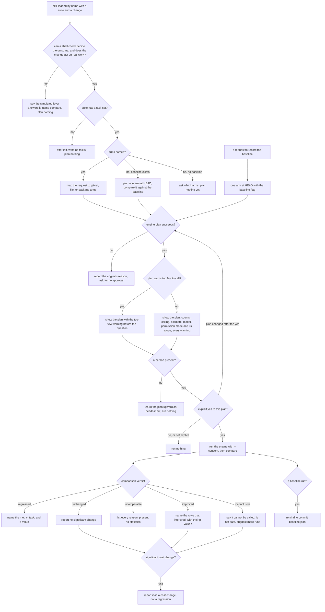

# skill — measure a change for real, spending only on an explicit yes

The `bench` skill puts a person in front of the measured-layer engine (`../engine/`). It checks the
question is one real runs can answer, shows the plan and its price, runs only after the person says
yes to that plan, and reports what the numbers can and cannot claim.

## What

The engine can spend real money and returns statistics that are easy to over-read. This skill is the
part with judgment around both. It decides whether a measured run is the right tool for the question
at all, picks the arms from what the person asked, and never spends without an explicit yes to the
exact plan on screen. Afterwards it says plainly whether the change regressed, improved, or could not
be called — and never presents an unclear result as safe, or a price change as a regression.

It is reached **by name**: from `/bench`, from `agent-readiness`'s hand-off for the suite
`repobuddy.readiness`, and later from `compare`'s measured mode. It is never matched to a user's
situation from its description. So it makes no activation decision of its own.

**Fit:** partial — the skill runs a fixed procedure (fit check → arms → plan → consent → run →
report) reached by name, so trigger near-miss balance is N/A; its behavior carries real signal,
because the consent rule, the headless refusal, and how it words an inconclusive or incomparable
result are agent conduct a judge must grade.

**Non-goals** — the statistics, the record schema, the run sequence, and every number in the plan
(`../engine/`); declaring a subject's `measured` fit in its `eval.md` (the spec-producer, under
`aced:aced-fit`); the simulated diff (`../../compare/`); the project-wide roll-up (`../../report/`);
choosing tasks for a suite (the suite maintainer writes `tasks.json`); a model matrix (a separate
change). The skill is driven by the change in hand, not by the subject's `bench:` declaration: a
declared `measured: worth` does not skip the fit re-ask, and an absent or `not-worth` declaration does
not by itself stop a person from measuring.

**Key terms** — **arm**, **suite**, **plan**, **ceiling**, **too few**, and the verdicts
(`regressed`, `inconclusive`, `improved`, `unchanged`, `incomparable`) are the engine's
(`../engine/README.md`). **Consent** here means one thing: the person's explicit yes to the plan
currently shown.

## Use Cases

### Actors and their goals

| Actor | Goal |
|---|---|
| **A developer** changing a skill, an AGENTS.md section, a plugin version, or repo setup | Learn whether the change makes real work turn out better or worse, for a known price. |
| **`agent-readiness`** (by name, suite `repobuddy.readiness`) | Get a comparison record for a lever so it can calibrate its weights. |
| **A headless driver** (`sdd-automaton`, a coordinator, a scheduled agent) | Move a mission forward without a person present. |
| **The person paying** *(stakeholder)* | Never be charged for a run they did not approve, and never be misled about what a result shows. |
| **A maintainer recording a baseline** | Refresh the suite's committed `baseline.json`. |

### UC1 — measure a change (`/bench`, or a by-name hand-off)

**Actor** developer, or `agent-readiness`. **Goal** a trustworthy verdict on a change, at a price they
agreed to.

| Trigger | Inputs | Outcome |
|---|---|---|
| the skill is loaded with a suite and the change to measure | suite, arms (or none), runs | a plan shown and approved, the arms run, and a plain report of the verdict |

Extensions:

- **The question is not one real runs answer** — the change only rewords a description or alters when
  something triggers, or the outcome could only be graded by a rubric, not a shell check → the skill
  says the simulated layer answers it, names `compare`, and plans nothing.
- **The suite has no task set** → it says so and offers `init`; it writes no tasks of its own and plans
  nothing.
- **No arms named** → with a committed baseline, it plans one arm at HEAD and compares that arm's
  record against the baseline; with none, it asks which arms to compare instead of guessing.
- **The plan fails** (no adapter, missing harness command, unresolvable subject) → it reports the
  engine's reason and asks for no approval.
- **The plan warns too few to call** → the warning is stated before the approval question, with what it
  means: no result at this run count can be called significant.
- **The plan carries any other warning** (for example, uncommitted changes that a git-ref arm will not
  bench) → it is shown with the plan, before the question.
- **The reply is not an explicit yes** (a question, "sounds good I guess", silence) → no run.
- **Approval was given before the plan was shown** ("just run it, I'm fine with the cost") → the plan
  is still shown and the question still asked.
- **The person changes the plan after saying yes** (more runs, another task) → a new plan, a new
  question; the earlier yes does not carry over.

### UC2 — be driven with no person present

**Actor** a headless driver. **Goal** progress without blocking on a person.

| Trigger | Inputs | Outcome |
|---|---|---|
| the skill is loaded in a session with no user channel | suite, arms | the same fit, task-set, and arm checks as UC1; then the plan returned upward as needs-input; nothing run |

Extensions: the driver relays that "the user approved" → still not consent; the plan goes back up
unrun. (A CI job that wants unattended runs calls the engine's bin with `--consent` itself, under its
own accountability; the skill never does it on anyone's behalf.)

### UC3 — read the result

**Actor** developer, `agent-readiness`. **Goal** know what the comparison actually says.

| Trigger | Inputs | Outcome |
|---|---|---|
| the run finishes and the engine returns a comparison | the comparison record | a report led by the verdict, with the rows that drove it |

Extensions:

- `regressed` → it names the metric and task that moved the wrong way, with its p-value.
- `inconclusive` → it says the result cannot be called and is **not** evidence the change is safe, and
  says what would sharpen it (more runs per arm).
- `incomparable` → it lists every reason and presents no statistics as if they compared.
- `improved` → it names the rows that improved, with their p-values.
- A significant cost change with no gated regression → reported as a cost change, not a regression.

### UC4 — record a baseline

**Actor** maintainer. **Goal** a fresh committed `baseline.json`.

| Trigger | Inputs | Outcome |
|---|---|---|
| a request to record or refresh the suite's baseline | suite | a one-arm plan at HEAD with the baseline flag, approved and run, then a reminder to commit `baseline.json` |

Extensions: the same consent rules as UC1 apply unchanged (they are one path, not a copy).

### Surface trace

The skill exposes one entry (its name) and passes the person's choices through to the engine's flags
(`../engine/README.md`, surface trace). It adds no element of its own beyond the yes it relays as
`--consent`, which it relays only on UC1's explicit-yes edge.

## Control Flow

## Scenario map

### UC1 — measure a change

| Edge | Path (Given) | Scenario |
|---|---|---|
| `fit` → no (wording only) | a person present; a change that only rewords a skill description | `a change that only rewords a description is sent to compare and nothing is planned` |
| `fit` → no (rubric only) | a person present; an outcome no shell check can decide | `an outcome no shell check can decide is sent to the simulated layer and nothing is planned` |
| `fit` → yes | a person present; a change to a multi-step skill with a shell-checkable outcome | `a change that acts on real work with a checkable outcome is planned` |
| `tasks` → no | a person present; a suite with no task set | `a suite with no task set gets an init offer and no invented tasks` |
| `armsQ` → yes | two git refs named | `two named refs become two git-ref arms` |
| `armsQ` → no, baseline exists | no arms named; a committed baseline | `with no arms named and a baseline present, HEAD is measured against the baseline` |
| `armsQ` → no, no baseline | no arms named; no baseline | `with no arms named and no baseline, the skill asks which arms to compare` |
| `plan` → no | the engine plan fails for a missing harness command | `a failed plan is reported and no approval is asked for` |
| `few` → yes | a plan that warns too few to call | `a too-few-to-call warning is stated before the approval question` |
| `show` | a successful plan | `the plan shown names the ceiling, the estimate, and the permission mode with its scope` |
| `show` (warnings) | a plan carrying an uncommitted-changes warning | `every warning the plan carries is shown before the approval question` |
| `ask` → yes | the plan shown; the person replies yes | `an explicit yes to the shown plan runs it with consent` |
| `ask` → not explicit | the plan shown; the person replies with a hedge | `a reply that is not an explicit yes runs nothing` |
| `ask` → no (pre-approval) | the person approved spending before any plan was shown | `approval given before the plan was shown does not skip the question` |
| `ask` → plan changed | a yes, then a request for more runs | `a plan changed after the yes is shown and asked about again` |

### UC2 — be driven with no person present

| Edge | Path (Given) | Scenario |
|---|---|---|
| `channel` → no | a session with no user channel; a plan that succeeded | `with no person present the plan is returned as needs-input and nothing runs` |
| `channel` → no (relayed approval) | no user channel; a plan that succeeded; the driver relays that the user approved | `a relayed approval is not consent and nothing runs` |
| `fit` → no (headless) | no user channel; a wording-only change | `with no person present a wording-only change is still sent to compare` |

### UC3 — read the result

| Edge | Path (Given) | Scenario |
|---|---|---|
| `verdict` → regressed | a regressed comparison | `a regressed result names the metric, the task, and the p-value` |
| `verdict` → inconclusive | an inconclusive comparison | `an inconclusive result is reported as not callable and not safe` |
| `verdict` → incomparable | an incomparable comparison | `an incomparable result lists its reasons and presents no statistics` |
| `verdict` → improved | an improved comparison | `an improved result names the rows that improved and their p-values` |
| `cost` → yes | an unchanged verdict with a significant cost rise | `a significant cost rise with no regression is reported as a cost change` |

### UC4 — record a baseline

| Edge | Path (Given) | Scenario |
|---|---|---|
| `baseReq` → `oneArm` | a request to refresh the baseline | `a baseline request plans one arm at HEAD with the baseline flag` |
| `baseDone` → yes | an approved baseline run that finished | `after a baseline run the skill says to commit baseline.json` |
