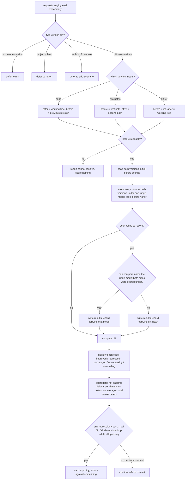
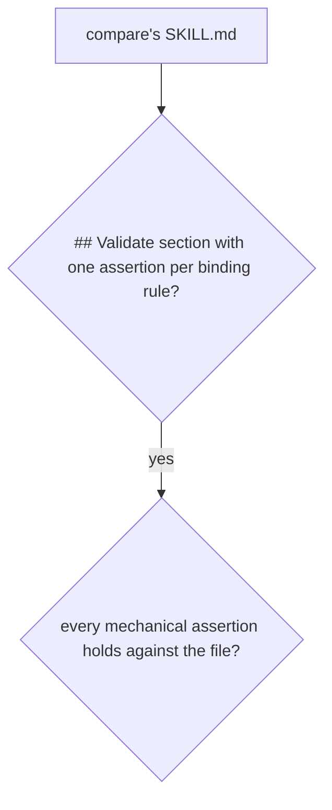

# compare — diff two config versions for regressions

## What

Run the golden set against a before-version and an after-version and classify each case (improved /
regressed / unchanged / now-passing / now-failing), gating on regressions before a change is committed.

In **measured mode** it instead diffs two real-run records of a bench suite through the measured-layer
engine (`../bench/engine/`), and words the engine's verdict as the same commit gate.

## Use Cases

**Subject** — scoring two versions of a target agent configuration against the same golden set and
diffing the results to catch regressions before a change is committed.
**Non-goals** — scoring a single version (`run`); the project-wide roll-up (`report`); authoring or
fixing cases (`add-scenario` / `improve`); deciding a single case's pass/fail (that is `aced-case-judge`).
In measured mode: every statistic, the record schema, and the verdict (the engine's `compare` verb,
`../bench/engine/README.md` UC4); launching or planning real runs (the `bench` skill, `../bench/skill/`).

**The scoring model on a persisted comparison.** A diff scores both sides in **one** invocation, so
one model scores both — the field is a property of the comparison, not of a side, and no cross-model
diff is constructible here. It carries the same two states `run`'s does (the model `compare` can name
it dispatched under, `unknown` exactly when it cannot), which is what keeps a persisted comparison
readable on the same terms as a run's record by anything that later scans the results directory.

**Fit:** strong — the capability carries a genuine activation decision (a two-version diff request
versus sibling eval intents — `run` / `report` / `add-scenario` — that share the same eval
vocabulary), and its version resolution, per-dimension diff classification, and regression-gate
behavior are judged, not asserted.

| Use case | Trigger / inputs | Outcome |
|---|---|---|
| Trigger on a comparison request | a request to compare / diff two versions or check for regressions, vs. a sibling intent (score one version, project roll-up, author a case) carrying the same eval vocabulary | `compare` fires for a two-version diff and defers when the intent belongs to `run` / `report` / `add-scenario` |
| Resolve the two versions | no explicit versions (default: working tree vs. previous revision), two explicit paths, or a git ref for the "before" | a before-version and an after-version are identified and both read in full |
| Score both versions | the resolved versions and the shared golden set | every case is scored against both versions and labeled before / after |
| Diff and classify | the before / after per-case results | each case is classified improved / regressed / unchanged / now-passing / now-failing, with a net pass-rate delta and per-dimension deltas; raw totals are never averaged across cases; the simulated diff persists nothing unless the user asks (measured mode: see below) |
| Record the model a persisted diff was scored under | a request to record the comparison | the results record carries the judge model both sides were scored under |
| Gate on regression | the classified diff | a regression — a pass→fail flip **or** a dimension drop while the case still passes — blocks with an explicit warning; a clean net-improvement is confirmed safe to commit |

### Measured mode — diff two real-run records of a bench suite

The simulated diff above stays exactly as it is. Measured mode is a second entry into `compare` for
the **measured layer** (`../../design/fit.md`, the measured axis): real headless runs of a bench
suite, graded by a shell check and recorded by the engine under `.agents/aced/results/bench/<suite>/`
(run records `<createdAt>.<arm>.json`, comparison records `compare-<createdAt>.json`). Simulated results
live under `.agents/aced/results/<target-slug>/`; the two share the directory, never a key, and are
**never compared with each other**.

**Key terms** — **suite**, **arm**, **run record**, **comparison record**, **baseline**, **too few**
(`tooFew`), **gated metric**, the **test count**, and the verdicts (`regressed`, `inconclusive`,
`improved`, `unchanged`, `incomparable`) are the engine's (`../bench/engine/README.md`). `compare`
computes none of them; it picks the two records, calls the engine, and words what comes back.

#### Actors and their goals

| Actor | Goal |
|---|---|
| **A developer** who already has real-run records for two arms | Know whether the change regressed real work before committing it, with noise never read as a regression. |
| **A consumer tool** handing off by name with its own suite and tags | Get the engine's comparison for its suite, stamped with its own tags. |
| **A developer who mixes layers** (asks to diff a simulated result against a measured record) | Be told plainly that the two cannot be compared, rather than be shown a number that means nothing. |
| **The person deciding to merge** *(stakeholder)* | Never be told a non-significant move is a regression, or that a result that cannot be called is safe. |

#### UC-M — `compare --layer measured --suite <s> --before <arm|record|baseline> --after <arm|record> [--tag k=v …]`

| Trigger | Inputs | Outcome |
|---|---|---|
| a request that names the measured layer — a bench suite, its arms, real-run records, or `--layer measured` | suite, a before side and an after side, optional tags | the engine's comparison shown row by row with its test count, and the engine's verdict worded as the commit gate |

Extensions:

- **One side is a simulated result** → refused as incomparable by layer: nothing is scored and the
  engine is not called.
- **A request to plan or run a new measurement** (fresh real runs, not a diff of existing records) →
  `compare` declines it and starts no plan or run. It does not route the request anywhere: the `bench`
  skill is reached by name only (`/bench`, or a by-name hand-off), never matched to a request.
- **No suite named** → it asks the person which suite and compares nothing; it never guesses, even when
  only one suite exists. **With no person present** the same question goes back up as needs-input, and
  nothing is compared.
- **A side names an arm label** → that arm's latest run record in `results/bench/<suite>/` (by
  `createdAt`). **A side names a record path** → that record, as named. **`--before baseline`** → passed
  through to the engine, which reads the suite's committed `baseline.json`. **`--after baseline`** → refused
  before any engine call, with nothing compared: the engine takes the baseline as the before side only.
- **An arm has no run record** → it says so and names `/bench` (the `bench` skill) as the next step;
  it loads, plans, and runs nothing. `compare` never plans, runs, or spends.
- **Tags** → passed to the engine's `compare` unchanged; never added, dropped, or interpreted.
- **The engine refuses** (a record of another schema version, a missing baseline) → the engine's reason
  is reported and no verdict is given.
- **`incomparable`** (different model, harness, adapter, runner, subject kind, or task set) → every
  reason is listed and no statistics are presented as if they compared.
- **Comparable** → per task and metric: both sides' ranges, the delta, `p`, and `tooFew`; the pooled
  rows; the pass-rate delta with its p-value; and the engine's test count with how many significant rows
  chance alone would produce (multiplicity is disclosed, not corrected — issue #77).
- **`regressed`** → an explicit warning naming the row, and advice not to commit.
- **`inconclusive`** → the result cannot be called; it is neither a regression nor safe; more runs per
  arm would sharpen it.
- **`improved`**, or **`unchanged`** at a run count that can call a change → confirmed safe to commit.
- **`unchanged` while every gated row is `tooFew`** → the run count was too low to call anything; not
  confirmed safe.
- **A significant cost (`costUsd`) or cache-read (`cacheReadTokens`) change with no gated regression** →
  reported as a change that does not gate, never a regression. Dollars and cache reads never gate.
- **Recording** → the engine writes the comparison record itself on every comparable or incomparable
  compare. Measured mode asks nothing about recording and writes no record of its own; the simulated
  diff's "persist only on request" rule does not apply to it.

**Commit-gate wording is `compare`'s alone, and deliberate.** The `bench` skill reports a callable
`unchanged` as "no significant change" and never speaks of committing (`../bench/skill/README.md`, UC3).
`compare` is the commit gate, so it — and only it — turns the engine's verdict into commit advice:
`regressed` → do not commit; `improved`, or `unchanged` at a callable run count → safe to commit;
`inconclusive`, or `unchanged` with every gated row `tooFew` → never safe, never a regression. The
verdict itself is the engine's in every case; only the advice is `compare`'s.

#### Validate section — the binding rules

Measured mode states rules the agent loading `compare` must never break, so `SKILL.md` carries a
`## Validate` section with one artifact-state assertion per rule (`aced:aced-builder-spec`,
Validate-section coverage):

1. It never plans, runs, or spends — no `aced-bench plan` or `run`; a missing record goes to `bench`.
2. It never presents `inconclusive`, or `unchanged` with every gated row `tooFew`, as safe.
3. Cost (`costUsd`) and cache reads never gate — a cost change is never a regression.
4. It never guesses the suite.
5. It never compares a simulated result with a measured record.

#### Surface trace

| Element | Needed by | May not combine with |
|---|---|---|
| `--layer measured` | UC-M — selects measured mode | a simulated result or config version as either side |
| `--suite` | UC-M — which bench suite's records | — |
| `--before` | UC-M — arm label, record path, or `baseline` | — |
| `--after` | UC-M — arm label or record path | `baseline` (refused before any engine call; the engine takes the baseline as the before side only) |
| `--tag k=v` | UC-M — a consumer stamps its own meaning on the comparison | — |

## Control Flow



### Measured mode

```mermaid
flowchart TD
  req[request carrying eval vocabulary] --> route{two-version diff?}
  route -- plan or run a new bench measurement --> declineBench[decline: compare nothing, start no plan or run]
  route -- names the measured layer --> mode{are both sides measured?}
  mode -- one side is a simulated result --> refuseLayer[say simulated and measured results never compare; score nothing, call no engine]
  mode -- both measured --> suiteQ{suite named?}
  suiteQ -- no, a person present --> askSuite[ask the person which suite; call no engine]
  suiteQ -- no, no person present --> needsSuite[return the which-suite question as needs-input; call no engine]
  suiteQ -- yes --> side{what does each side name?}
  side -- arm label --> latest[that arm's latest run record under results/bench/suite]
  side -- record path --> asNamed[that record, as named]
  side -- before is baseline --> base[pass --before baseline through to the engine]
  side -- after is baseline --> refuseAfterBase[refuse: baseline is a before side only; call no engine, compare nothing]
  latest --> hasRec{arm has a run record?}
  hasRec -- no --> handoff[say so and name /bench, the bench skill, as the next step; load, plan, run, and compare nothing]
  hasRec -- yes --> call
  asNamed --> call
  base --> call[call aced-bench compare --suite --before --after with the caller's tags unchanged; dispatch no case-judge scoring]
  call --> refused{engine refused?}
  refused -- yes --> repRef[report the engine's reason; no verdict]
  refused -- no --> incomp{verdict incomparable?}
  incomp -- yes --> repIncomp[list every reason; present no statistics]
  incomp -- no --> rows[show per-task and per-metric ranges, delta, p, tooFew; pooled rows; pass-rate delta with its p]
  rows --> footer[state the engine's test count and the count chance alone would make significant]
  footer --> mgate{the engine's verdict}
  mgate -- regressed --> mwarn[warn explicitly naming the row; advise against committing]
  mgate -- inconclusive --> minc[say it cannot be called; neither a regression nor safe; suggest more runs per arm]
  mgate -- improved --> msafe[confirm safe to commit]
  mgate -- unchanged --> allFew{every gated row tooFew?}
  allFew -- yes --> mfew[say the run count was too low to call anything; do not confirm safe]
  allFew -- no --> msafe
  msafe --> cost{significant cost or cache-read change?}
  minc --> cost
  cost -- yes --> costNote[report it as a change that does not gate, never a regression]
  cost -- no --> norec
  costNote --> norec
  mwarn --> norec
  mfew --> norec
  repIncomp --> norec[ask nothing about recording; write no record of compare's own; the engine wrote the comparison record]
```

### The skill artifact — binding rules



## Scenario map

One row per edge in the graph above, one scenario per row. Rows follow the suite's section order.

| Edge | Path (Given) | Scenario |
|---|---|---|
| `route` → diff two versions | a request to compare two versions of a configuration | `a request to diff two versions triggers compare` |
| `route` → defer to run | a request to score the current configuration | `a request to score one version defers to run` |
| `route` → defer to report | a request for eval health across all suites | `a request for a project-wide health summary defers to report` |
| `route` → defer to add-scenario | a request to add a new case to the suite | `a request to author or fix a case defers to add-scenario` |
| `resolve` → none (default) | no versions named | `the default compares the working tree against the previous revision` |
| `resolve` → two paths | two configuration paths provided | `two explicit paths are used as the two versions` |
| `resolve` → git ref | a git ref for the before version | `a git ref names the before version` |
| `readable` → no (abort) | a before version that cannot be read | `an unresolvable before version is reported` |
| `readable` → yes (read in full) | two resolved versions | `both versions are read in full before scoring` |
| score both vs golden set | two resolved versions and a golden set | `both versions are scored over the same golden set` |
| classify each case | the before and after results | `each case is classified by its change` |
| `aggregate` → net passing delta | the before and after results | `the net change across cases is reported` |
| `aggregate` → no averaged total | per-case totals whose maxima differ | `raw totals are not averaged across scenarios into one score` |
| `persist` → no (default) | a completed diff, no request to record | `a diff is not persisted by default` |
| `persist` → yes (on request) | the user asks to record the comparison | `a diff is persisted only on request` |
| `write` → yes | the user asks to record a comparison whose judge model compare can name | `a persisted comparison records the model it was scored under` |
| `write` → no | the user asks to record a comparison whose judge model compare cannot name | `a persisted comparison that cannot name its judge model records unknown` |
| `gate` → pass→fail flip → warn | a case dropped from passing to failing | `a regressed case blocks the commit with a warning` |
| `gate` → dimension drop while passing → warn | a case stays passing but a dimension dropped | `a dimension that drops while the case still passes is flagged as a regression` |
| `gate` → no regression → safe | no regressed case and a net improvement | `a clean net improvement is confirmed safe to commit` |

### Measured mode

| Edge | Path (Given) | Scenario |
|---|---|---|
| `route` → names the measured layer | a request to compare two arms of a bench suite | `a request to compare two measured arms of a bench suite triggers compare` |
| `route` → plan or run a new bench measurement (decline) | a request for fresh real runs of a bench suite | `a request to plan or run a bench measurement is not handled by compare` |
| `mode` → one side simulated | a simulated run result named against a measured run record | `a request to compare a simulated result against a measured record is refused as incomparable by layer` |
| `mode` → both measured | `--layer measured` with a run record for each arm | `a measured-layer request is diffed by the engine and no case is scored` |
| `suiteQ` → no, a person present | two arms named, no suite named, one suite in the project | `a measured request that names no suite is asked for one and nothing is compared` |
| `suiteQ` → no, no person present | no user channel, two arms named, no suite named | `with no person present, a measured request that names no suite returns the question as needs-input and compares nothing` |
| `side` → arm label → `hasRec` → yes | several run records per arm, of different ages | `an arm label resolves to that arm's latest run record` |
| `side` → record path | an older record of an arm named by path | `a record path is passed to the engine as named` |
| `side` → before is baseline | `--before baseline` and a committed baseline | `a before side of baseline is passed to the engine as the baseline` |
| `side` → after is baseline | `--after baseline` | `an after side of baseline is refused and nothing is compared` |
| `hasRec` → no | an arm with no run record | `an arm with no run record is handed to bench and no run is planned or launched` |
| `call` (tags) | a consumer hand-off carrying a tag | `a caller's tags reach the engine's compare unchanged` |
| `refused` → yes | the engine refuses a record of another schema version | `a measured compare the engine refuses is reported with its reason and no verdict` |
| `incomp` → yes | an incomparable comparison with two reasons | `an incomparable measured comparison lists every reason and presents no statistics` |
| `rows` | a comparable comparison over two tasks | `a comparable measured result shows the per-task, pooled, and pass-rate rows` |
| `footer` | a comparable comparison with a stated test count | `the engine's test count is disclosed with the count chance alone would make significant` |
| `mgate` → regressed | a regressed comparison | `a regressed measured result blocks the commit with a warning naming the row` |
| `mgate` → inconclusive | an inconclusive comparison with a wrong-way non-significant move | `an inconclusive measured result is reported as neither a regression nor safe` |
| `mgate` → improved | an improved comparison | `an improved measured result names the improved row and is confirmed safe to commit` |
| `allFew` → yes | an unchanged comparison whose gated rows are all tooFew | `an unchanged measured result at a too-few run count is not confirmed safe` |
| `allFew` → no | an unchanged comparison at a callable run count | `an unchanged measured result at a callable run count is confirmed safe to commit` |
| `cost` → yes | an unchanged comparison whose cost and cache-read rows rose significantly | `significant cost and cache-read rises with no gated regression are reported as non-gating changes` |
| `norec` | a completed measured comparison, no request to record | `a measured comparison asks nothing about recording and writes no record of its own` |

### The skill artifact — binding rules

| Edge | Path (Given) | Scenario |
|---|---|---|
| `val` → yes | compare's SKILL.md | `the compare skill carries a Validate section with one assertion per binding rule` |
| `holds` → yes | compare's SKILL.md and its Validate section | `every mechanical Validate assertion passes against the compare skill` |

Cross-capability e2e scenarios live in `../../workflows/`.
