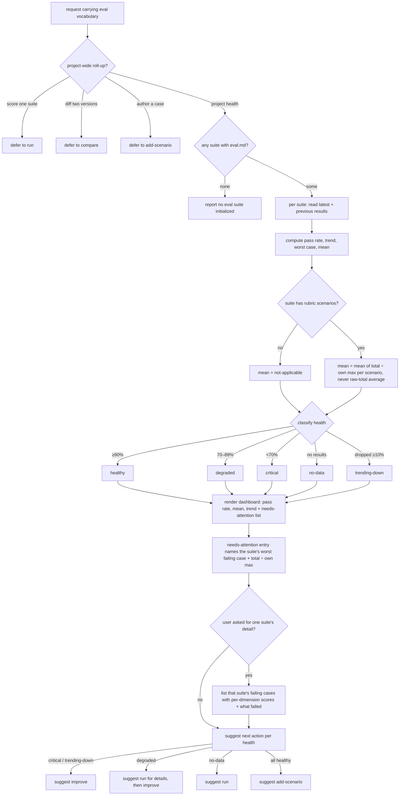
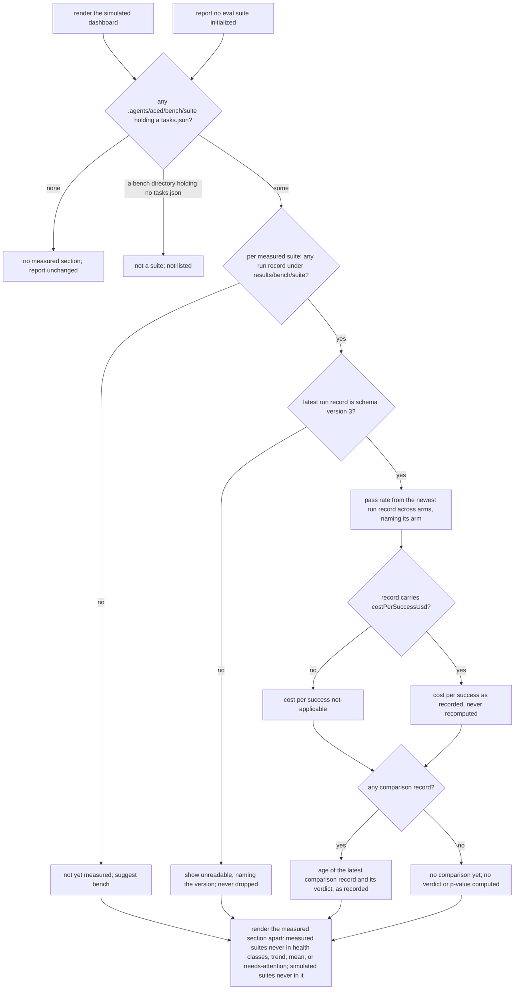
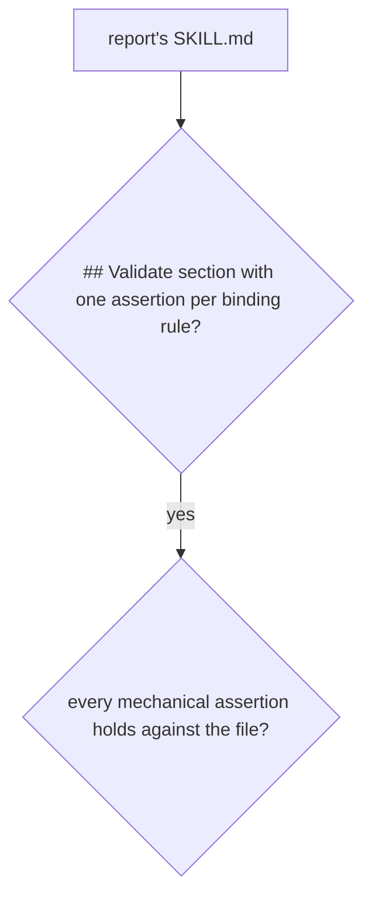

# report — project-wide eval health

## What

Roll every eval suite in the project into one health dashboard: per-suite pass rate, trend versus the
previous run, a health classification, a needs-attention list, and the next action to take per suite.
Measured suites (the bench suites of the measured layer, `../bench/`) are listed in a **section of their
own** and never share a trend line or a health class with simulated suites.

## Use Cases

**Subject** — rolling every eval suite in the project into one health dashboard: per-suite pass
rate, trend versus the previous run, a health classification, and what needs attention.
**Non-goals** — scoring a single suite (`run`); diffing two versions (`compare`); authoring or
fixing cases (`add-scenario` / `improve`); deciding a single case's pass/fail (that is `aced-case-judge`).
For measured suites: every statistic and every verdict (the engine, `../bench/engine/`); diffing two
measured arms (`compare`'s measured mode); running or planning real runs (`bench`).

**Fit:** strong — the capability carries a genuine activation decision (a project-wide roll-up request
versus sibling eval intents — `run` / `compare` / `add-scenario` — that share the same eval
vocabulary), and its discovery, five-way health classification, `%max` normalization, and next-action
routing are judged, not asserted.

| Use case | Trigger / inputs | Outcome |
|---|---|---|
| Trigger on a health-summary request | a request for the project-wide eval health / which configs need attention, vs. a sibling intent (score one suite, diff two versions, author a case) carrying the same eval vocabulary | `report` fires for a project-wide roll-up and defers when the intent belongs to `run` / `compare` / `add-scenario` |
| Discover the suites | the project spec (`.agents/specs/`), or none | every behavioral-leaf node with an `eval.md` is discovered, reading its latest and previous results; a no-suite message when none exist |
| Classify each suite's health | the latest and previous results per suite | each suite is classified healthy / degraded / critical / no-data / trending-down |
| Render the dashboard | the per-suite metrics | a dashboard of pass rate, mean `%max`, and trend per suite (mean normalized per scenario, never a raw-total average; `—` when a suite has no rubric scenario), plus a needs-attention list and an optional per-suite detail mode |
| Suggest the next action | each suite's health | the matching next skill is suggested per health (critical/trending-down → improve, degraded → run then improve, no-data → run, all-healthy → add) |

### Measured section — the bench suites, apart

A **measured suite** is a task set at `.agents/aced/bench/<suite>/tasks.json`; its real-run records sit
under `.agents/aced/results/bench/<suite>/` (run records `<createdAt>.<arm>.json`, comparison records
`compare-<createdAt>.json`, schema version 3 — `../bench/engine/README.md`). Simulated suites are found
by `eval.md` and read from `.agents/aced/results/<target-slug>/`. The two kinds share the results
directory, never a key, a table, a trend line, or a health class.

#### Actors and their goals

| Actor | Goal |
|---|---|
| **A developer or maintainer** checking project health | See at a glance how each measured suite last turned out and how stale its last comparison is. |
| **A project that measures nothing** *(stakeholder)* | See the report exactly as before — no empty measured section, no new noise. |
| **A project that only measures** *(stakeholder, e.g. a consumer tool's own suites)* | Still see its measured suites, even with no simulated suite. |
| **The person reading the dashboard** *(stakeholder)* | Never see a measured pass rate judged against simulated health bars, or a verdict the report made up. |

#### UC-R2 — the measured section of `report`

| Trigger | Inputs | Outcome |
|---|---|---|
| the same project-wide health request as above | every `.agents/aced/bench/<suite>/` that holds a `tasks.json`, and that suite's records | a measured section listing each suite with its latest pass rate (and the arm it came from), cost per success, and the age and verdict of its last comparison |

Extensions:

- **No measured suite** → no measured section at all; the report is unchanged.
- **Only measured suites** (no simulated suite) → the simulated part reports none initialized, and the
  measured section is still shown.
- **A `.agents/aced/bench/<suite>/` directory with no `tasks.json`** (for example one holding only a
  `baseline.json`) → not a suite; not listed.
- **A suite with no run record** → shown as **not yet measured**, with `bench` as its next action. The
  label is deliberately not `no-data`: a measured row never reuses a simulated health-class name.
- **The latest run record is of another schema version** → the suite is shown as unreadable, naming the
  version; it is never dropped silently.
- **The latest run record carries no `costPerSuccessUsd`** (the engine leaves it out when no run
  passed) → cost per success is shown as not-applicable, never as zero or infinite.
- **No comparison record** → shown as no comparison yet; the report never computes a verdict or a
  p-value of its own, even from two run records.
- **A measured pass rate below a simulated health bar, or falling between runs** → still never classified
  healthy / degraded / critical / trending-down, never in the `%max` mean or the trend, never on the
  needs-attention list. **A simulated suite** → never listed in the measured section.

**Latest** means the run record with the newest `createdAt` **across all arms** of the suite, and the row
names the arm it came from — so a newer `without` run is never hidden behind an older `with` run. Cost
per success is that record's own `costPerSuccessUsd`, read as recorded and never recomputed (the engine
owns every statistic, `../bench/engine/README.md`). The age is the time from the latest comparison
record's `createdAt` to now, in whole days, floored; its verdict is shown exactly as recorded.

#### Validate section — the binding rules

The measured section states rules the agent loading `report` must never break, so `SKILL.md` carries a
`## Validate` section with one artifact-state assertion per rule (`aced:aced-builder-spec`,
Validate-section coverage):

1. It never computes a verdict or a p-value of its own.
2. It never puts a measured suite into a simulated health class, the trend, or the needs-attention list.
3. It never drops an unreadable record silently.

## Control Flow

### Measured section

### The skill artifact — binding rules

## Scenario map

One scenario per row, following the suite's section order. Each CFG edge is bound; the `next` map
scenario is an enumeration that covers the healthy / critical / trending-down / no-data class→action
edges in one row, with `degraded` bound in its own row.

| Edge | Path (Given) | Scenario |
|---|---|---|
| `route` → project health | a request for the eval health across the project | `a request for project-wide health triggers report` |
| `route` → defer to run | a request to score a single configuration | `a request to score one suite defers to run` |
| `route` → defer to compare | a request to compare two versions | `a request to diff two versions defers to compare` |
| `route` → defer to add-scenario | a request to add a case for a failure | `a request to author a case defers to add` |
| `discover` → some | a project tree with several eval suites | `every suite with an eval is discovered` |
| `discover` → none | a project tree with no eval suite | `no suites reports that none is initialized` |
| `read` latest + previous | a suite with more than one results record | `the latest and previous results are read per suite` |
| `classify` → ≥90% | a suite passing at or above the healthy bar | `a high-passing suite is classified healthy` |
| `classify` → <70% | a suite passing below the critical bar | `a low-passing suite is classified critical` |
| `classify` → 70–89% | a suite passing between the bars | `a mid-band suite is classified degraded` |
| `classify` → no results | a suite with no results record | `a suite with no results is classified no-data` |
| `classify` → dropped ≥10% | a suite whose pass rate fell sharply | `a dropping suite is classified trending-down` |
| `dash` render | the per-suite metrics | `the dashboard shows each suite with its trend and attention list` |
| `mean` → normalized | a suite whose scenarios declare different maxima | `the mean column normalizes each scenario rather than averaging raw totals` |
| `hasrubric` → no (`—`) | a suite whose scenarios are all boolean or trigger | `a suite with no rubric scenarios shows no mean` |
| `worst` name in attention | a suite needing attention with a failing case | `the needs-attention entry names the suite's worst failing case` |
| `detail` → yes | a request for one suite's detail | `a request for one suite's detail lists its failing cases` |
| `next` map (all classes) | suites across several health classes | `each suite is given a matching next action` |
| `next` → degraded → run | a suite classified degraded | `a degraded suite is pointed at run for detail` |

### Measured section

| Edge | Path (Given) | Scenario |
|---|---|---|
| `msec` → none | a project whose only suites are simulated | `a project with no measured suite gets no measured section` |
| `msec` → some | a project with two measured suites beside a simulated one | `every measured suite with a task set is listed in the measured section` |
| `msec` → a bench directory holding no tasks.json | a bench directory holding only baseline.json beside a real suite | `a bench directory without a task set is not listed as a measured suite` |
| `noinit` → `msec` | a project whose only suite is measured | `a project with only measured suites still gets its measured section` |
| `mpass` → yes → `mcmp` → yes | a measured suite with run records and comparison records of different ages | `a measured suite shows its latest pass rate, cost per success, and last comparison's age and verdict` |
| `mrate` (arms interleaved) | a newer run record of one arm after an older record of the other | `the latest pass rate comes from the newest run record across arms and names its arm` |
| `mpass` → no | a latest run record carrying no costPerSuccessUsd | `a measured suite with no passing run shows cost per success as not applicable` |
| `mcmp` → no | two run records and no comparison record | `a measured suite with no comparison record shows none and computes no verdict` |
| `mrec` → no | a measured suite with a task set and no run record | `a measured suite with no run record is shown as not yet measured and pointed at bench` |
| `mver` → no | a latest run record of schema version 2 | `a measured run record the report cannot read is shown as unreadable` |
| `msep` (measured suite) | a measured suite whose pass rate is low and falling | `a measured suite never enters the simulated health classification` |
| `msep` (simulated suite) | a simulated suite with results beside a measured suite | `a simulated suite never appears in the measured section` |

### The skill artifact — binding rules

| Edge | Path (Given) | Scenario |
|---|---|---|
| `val` → yes | report's SKILL.md | `the report skill carries a Validate section with one assertion per binding rule` |
| `holds` → yes | report's SKILL.md and its Validate section | `every mechanical Validate assertion passes against the report skill` |

Cross-capability e2e scenarios live in `../../workflows/`.
