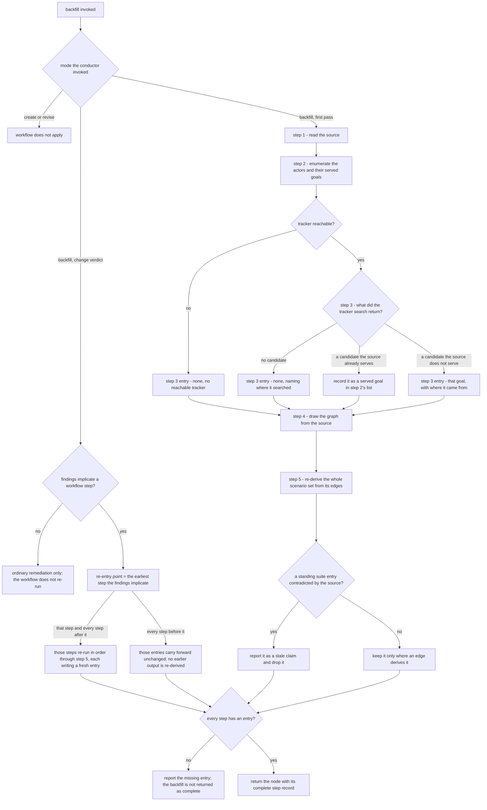

# backfill — derive a spec + suite from behavior that already shipped

The **backfill workflow**: the ordered procedure the spec-producer runs when the behavior it is
specifying **already exists in code**. Five steps, each owing a **named entry** in one **step
record** the producer returns. The steps are not new — their content rules already live in
`../spec-format/README.md` and `../suite-format/README.md`. What is new is that each step now owes
something a reader can point at, so a **skipped step is visible** instead of looking exactly like a
step that ran and found nothing.

## What

A backfill is the hardest authoring mode because its input is a working implementation, and a
working implementation is **persuasive**: it answers every question you think to ask, so the cheapest
route is to read it, write down what it does, and stop. That route produces a spec that reproduces
the code and can never say what the code is **missing** — the served use cases with no unserved ones,
the standing suite patched rather than re-derived, the branches the source happens to take rather
than the branches the capability owes. The decision that a backfill **derives rather than patches**
is [ADR-0029](../../../../../docs/adr/0029-backfill-produces-and-rederives-from-the-cfg.md); this
node is the workflow that enacts it.

The five steps are ordered so each one's input is the previous one's output:

| # | Step | The entry it owes | Rule it runs under |
|---|---|---|---|
| 1 | **read the source** | the read-set it read | — |
| 2 | **enumerate the actors and their goals** | the actor-to-goal list, drawn by actor | `../spec-format/README.md` |
| 3 | **recover the unserved goals** | each unserved goal with where it came from, or `none` with where it looked | `../spec-format/README.md` |
| 4 | **draw the graph** | the drawn `## Control Flow` | `../spec-format/README.md` |
| 5 | **re-derive the scenario set** | the map rows and the `.feature` | `../suite-format/README.md` |

The **Rule** column is the point of the table: each step's *content* rule already has a home, and
this node **sequences** those homes rather than restating them. The middle column is what this node
adds.

**Non-goals.** It renders no gate verdict, freezes nothing, and does not decide the node's placement
(`../spec-gate/`, `../../project-spec/place-node/`). It does not restate the two bars it sequences.
It governs **backfill only**: a node authored in the producer's `create` or `revise` mode never
enters this workflow. It does not decide when a remediation loop has stopped converging — that is
`sdd:remediation-governance`'s regression rule, referenced below and never re-made here.

**Key terms.** A **served goal** is one the shipped code already has a way in for; an **unserved
goal** is one a real request asked for and the code does not serve. The **step record** is the
producer's structured list of one entry per step, returned alongside the spec and the suite
(`BACKFILL_STEPS`, `../spec-producer/README.md`). A **stale claim** is an entry in a standing suite
that the current source contradicts.

## Use Cases

**Subject** — running the ordered backfill workflow to derive a node's spec + suite from shipped
behavior, and re-deriving that node when a gate returns a `change` verdict against it.

**Actors.** The **spec-producer** invokes this workflow — in both modes below — and is the only actor
with a way in. Three parties are affected by its output without invoking it: the **cold spec-judge**,
whose pre-flight corroboration reads the step record (`../spec-gate/README.md`); the **conductor**,
which invokes the producer in backfill mode and relays both that mode and the record; and the **human
reviewer**, who reads step 3's provenance to see where the unserved goals were sought. None of the
three invokes the workflow, so none owns a use case row — their interests are served through the
outputs the two use cases already produce. They are listed because the enumeration closes both ways
(`../spec-format/README.md`).

| Use case | Actor / goal | Trigger | Inputs | Outcome |
|---|---|---|---|---|
| **derive** | spec-producer — a contract for shipped behavior that was *derived*, not transcribed | the conductor invokes the producer in `backfill` mode for a CR whose behavior already exists in code | the source, its tests, the project history, the issue tracker, and any standing `.feature` | the node's four spec sections + the `.feature`, plus a step record carrying one entry per step |
| **re-derive** | spec-producer — a backfilled node corrected at its **derivation** rather than at the lines a judge cited | a `change` verdict at either gate naming a node this workflow produced | the verdict's findings + the standing step record | the workflow re-run from the earliest implicated step through **every** downstream step, and a fresh step record |

**Extensions** — the paths from those triggers that do not reach those outcomes:

| Use case | Cause | Outcome |
|---|---|---|
| derive | the project has no reachable issue tracker | step 3's entry records `none — no reachable tracker`, naming the limitation; the step is never left out |
| derive | the tracker search returns no candidate goal at all | step 3's entry records `none` and names where it searched; an omitted entry is not the same claim as an empty one |
| derive | a goal recovered from the tracker turns out to be served by the source | it is recorded as a **served** goal in step 2's list, not reported as an unserved finding |
| derive | a standing `.feature` entry asserts behavior the current source does not have | it is reported as a **stale claim** and dropped; a standing entry survives only where an edge of the drawn graph derives it |
| derive | a step was never run, so the record has no entry for it | the backfill is **not returned as complete**; the missing entry is reported |
| re-derive | the verdict's findings implicate **no** step of the workflow | the workflow does not re-run; those findings are answered under `sdd:remediation-governance` alone |
| any | the conductor invoked the producer in `create` or `revise` mode | the workflow does not apply; there is no backfill to derive |

**Surface trace** — every input this workflow exposes, against the use case that needs it:

| Element | Needed by | May not combine with |
|---|---|---|
| `SOURCE_READ_SET` | derive | — |
| `TRACKER` (the issue forge / request history) | derive, at step 3 | — |
| `STANDING_SUITE` | derive, when one exists | — |
| `CHANGE_FINDINGS` | re-derive | — |
| `STEP_RECORD` (the standing record being re-derived from) | re-derive | — |

No pair on this surface is forbidden. `STANDING_SUITE` and `CHANGE_FINDINGS` are the pair that looks
contradictory — one says "a suite already exists", the other says "a judge rejected the one you
wrote" — but a re-derivation round legitimately sees both, and the standing suite is reference-only
under either, so naming the pair forbidden would assert a guard nothing enforces.

## Control Flow

## Re-derivation is the remediation unit

A gate's findings against a backfilled node are **evidence about the derivation**, not a work order
against the lines they cite. The general form of that rule is `sdd:remediation-governance`; this node
owns the one thing that bar leaves open — **what the unit of repair is** when the artifact was
derived rather than written.

The unit is the **node**, re-derived from its graph. Concretely: read each finding for the **step**
it implicates, re-enter at the **earliest** such step, and re-run every step downstream of it. It is
**not** a re-run from the top: steps before the re-entry point keep the entries they already have,
because nothing the findings touched was derived from them.
Editing a later output while an earlier one it was derived from still stands stale is the shape this
rule exists to prevent — it is how three rounds of patching produce a fourth round of findings.

The rule is bounded on both sides. Findings that implicate **no** step — a wording defect in prose
the workflow does not produce, a reference that no longer resolves — are answered under
`sdd:remediation-governance` alone; re-running the workflow for them buys nothing. And the
**regression** rule still governs the loop: a finding naming an artifact the previous round's commits
changed stops the loop for a re-plan rather than opening another round. That decision is
`sdd:remediation-governance`'s, referenced here and never re-made.

## The step record is the checkable output

Each step's entry names **what that step produced** — or states `none` **and where it looked**. The
distinction is the whole mechanism: a step that ran and found nothing and a step that was never run
are indistinguishable unless the first one says so. This is the discipline
`../spec-format/README.md` applies to a use case with no divergences (`extensions: none — <why>`
rather than an omitted field), applied one level up to the procedure itself.

The record is returned in the producer's structured output as `BACKFILL_STEPS`
(`../spec-producer/README.md`) and relayed to the cold spec-judge alongside the **mode** the
conductor invoked (`../../mission/conductor/README.md`). It is never written into `spec.md` or the
`.feature` — it is provenance about how the node was derived, not part of the contract.

**The record is corroborated by correspondence, not by length.** The gate checks each entry against
the artifact that entry claims to have produced; the per-step mapping is stated once, at
`../spec-gate/README.md`, and is not repeated here. A record with the right number of entries whose
content matches nothing is a fabrication, and fails. Counting entries would make the record one more
list, which is the shape this whole mechanism exists to get away from.

A record missing an entry means the backfill is **incomplete**, not merely under-documented: the
producer reports the missing entry rather than returning the node as complete. That report does not
withhold the CR from the gate — an incomplete record is relayed verbatim
(`../../mission/conductor/README.md`) and is the step-record tell's miss. A producer that could
suppress its own incomplete record by declining to return would be the same opt-out the mode gating
exists to close.

## Scenario map

| Edge | Path (Given) | Scenario |
|---|---|---|
| `M -- backfill, first pass --> S1` | a CR whose behavior already exists in code | `a backfill enters the ordered workflow at step one` |
| `M -- create or revise --> X` | a CR for a node the conductor invoked in create or revise mode | `a created or revised node does not enter the backfill workflow` |
| `S1 --> S2` | step 1 has read the source | `the served goals are enumerated from the source read-set` |
| `T -- yes --> V` | a project with a reachable issue tracker | `a reachable tracker is searched for unserved goals` |
| `T -- no --> T0` | a project with no reachable issue tracker | `an unreachable tracker is recorded as a named limitation` |
| `V -- no candidate --> V0` | a tracker search that returns no candidate goal | `a step that found nothing states none and where it looked` |
| `V -- a candidate the source already serves --> V1` | a tracker candidate the source has an entry point for | `a recovered goal the source already serves is recorded as served` |
| `V -- a candidate the source does not serve --> V2` | a tracker candidate the source has no entry point for | `an unserved goal is recorded with where it came from` |
| `T0/V0/V1/V2 --> S4` | the goals are settled | `the control-flow graph is drawn from the source` |
| `S4 --> S5` | a drawn graph | `the whole scenario set is re-derived from the graph edges` |
| `C -- yes --> C1` | a standing suite entry the current source contradicts | `a standing suite entry the source contradicts is dropped as a stale claim` |
| `C -- no --> C2` | a standing suite entry the current source still supports | `a standing suite entry survives only where an edge derives it` |
| `F -- no --> F1` | a workflow run in which one step was never run | `a record missing an entry is reported and the backfill is not complete` |
| `F -- yes --> F2` | a workflow run in which every step ran | `a complete record returns the node with its step record` |
| `R -- yes --> RS` | a change verdict whose findings implicate a workflow step | `a change verdict implicating a step re-enters the workflow at that step` |
| `RS -- that step and every step after it --> RE` | re-entry at step two | `every step downstream of the re-entry point re-runs` |
| `RS -- every step before it --> RK` | re-entry at step two | `steps before the re-entry point are not re-run` |
| `R -- no --> RO` | a change verdict whose findings implicate no workflow step | `findings implicating no step are answered without re-running the workflow` |
