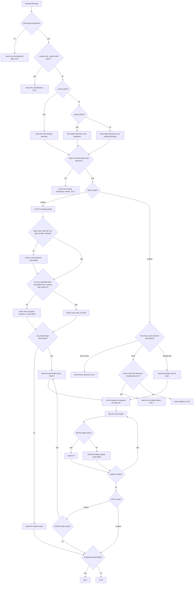

# spec-floor — run every project-spec's deterministic checks across the corpus

## What

A repo that adopts SDD gets a set of **deterministic spec checks** — is this node's structure
intact, does its suite bind to its scenario map, do its references resolve, does its lifecycle
state add up. Each check acts on **one** project-spec. Something has to run **all of them over all
of the project-specs**, on every commit and in CI, or the checks only guard the moment someone
remembers to invoke them.

**spec-floor** is that runner. It is the **harness** — it owns no check of its own; it resolves
which project-spec governs which project, runs the project-spec-tier engines against each, and
returns one exit code. Two ways in:

- **corpus scope** — the whole collection, for a commit or a CI run.
- **project scope** — one project-spec, for an author working inside it or for a gate judging a
  change to it.

**The floor is total or it is not a floor.** A runner that checks *some* of the corpus reports
green over the part it skipped, and green is what the repo treats as clearance to commit. So the
corpus scope is **defined by totality**: every project-spec the corpus holds is checked, and a
project-spec the runner cannot classify is a **failure**, never a skip.

Totality needs **two** sub-checks that neither subsumes the other:

| Sub-check | Answers | Blind to |
|---|---|---|
| **the check sweep** | for every project-spec discovery *recognizes*, do its engines pass? | a spec discovery does not recognize |
| **the coverage guard** | is every spec file at a spec location recognized, and reachable from a project that would check it? | whether the checks actually pass |

Discovery classifies a spec by its lifecycle `status`. A spec whose status is a typo is **dropped**
by discovery, so the sweep never sees it — and would report clean. The coverage guard sees the file
on disk and escalates it. Run either alone and a whole project-spec leaves the floor silently.

The coverage guard asks **two** questions in that one sentence, and they fail differently: a spec
that does not **classify** is invisible to discovery, while a spec that classifies but is reachable
from **no project that would check it** is visible and still unchecked. Both are drawn as their own
decision below, because the report has to name which one happened for the gap to be actionable.

**Non-goals.** It defines no check (each engine owns its own rules and its own node); it writes
nothing — no spec body, no `status`, no `approval`, no freeze; it fixes nothing it finds; it does
not decide *which* engines exist (that set is declared, and changing it is a change to this node);
and it is not a gate — a gate is a judged verdict on one change request, while the floor is a
mechanical check on the tree as it stands.

**Key terms.**

| Term | Plain meaning |
|---|---|
| **the floor** | the checks that must pass before a commit or a merge — mechanical, not judged |
| **corpus** | the collection of project-specs in one repo |
| **project-spec** | one project's spec — a root `spec.md` and its tree |
| **engine** | one deterministic check that acts on a single project-spec |
| **the engine set** | the declared list of engines the harness runs, in order |
| **coverage gap** | a spec file that no project would check, or that discovery cannot classify |
| **scope** | how much of the corpus one run covers — the whole corpus, or one project |

## Use Cases

**Actors, and the goals they arrive with.**

| Actor | Goal (their result, not their call) |
|---|---|
| the author about to commit (person or agent) | know that nothing in the corpus is structurally broken before committing |
| the pull-request check | reject a branch that broke a spec node, with the same guarantee the author had locally |
| a maintainer working inside one project | check that project's spec quickly, without paying for the others |
| the spec gate (the conductor at a gate) | run the mechanical floor over the project-spec a change request touched |
| **the downstream reader** (a judge, a producer, an `AGENTS.md` reader) — *affected, never invokes* | inherit a guarantee that is as strong as the one they were told they have |
| **a repo that installs SDD as a plugin** — *affected, never invokes* | get the same total floor without wiring recursion itself, whatever package manager it uses |

The two stakeholders are why the corpus scope is **one entry point with no weaker variant**. A
runner offering both a total mode and a cheaper partial mode hands the partial one to whoever wires
the commit chain, and the downstream reader inherits the weaker guarantee without ever seeing the
choice being made.

### UC1 — `--corpus`: check the whole corpus

| | |
|---|---|
| **Actor** | the committing author; the pull-request check |
| **Goal** | be told, before the change lands, if any project-spec in the corpus is broken |
| **Trigger** | the repo's own check chain invokes the harness with `--corpus` |
| **Inputs** | the repo root (found by walking up for the workspace marker) |
| **Outcome** | every recognized project-spec has had the whole engine set run against it, the coverage guard has run, and the exit code is 0 only if both found nothing |

**Extensions**

| Cause | Outcome |
|---|---|
| the repo root cannot be found | names that, exits non-zero — never falls back to the working directory |
| the coverage guard finds a spec that does not classify | names it as unrecognized, marks the run failed |
| the coverage guard finds a classified spec no project would check | names why nothing reaches it (no declared project-path, no manifest, no `check:spec` script), marks the run failed |
| any coverage gap at all | the run **still sweeps every recognized spec** before exiting non-zero — one run reports every defect it can see |
| an engine fails on one project-spec | names the engine, **sweeps the remaining project-specs anyway**, exits non-zero |
| the corpus holds no project-spec at all | reports that plainly and exits 0 — an empty corpus is not a defect |

### UC2 — `--project <dir>` (and the bare invocation): check one project-spec

| | |
|---|---|
| **Actor** | a maintainer inside one project; the spec gate |
| **Goal** | run the engine set against exactly one project-spec |
| **Trigger** | the harness is invoked with `--project <dir>`, or with no scope flag (the working directory is the project) |
| **Inputs** | a project directory |
| **Outcome** | the one project-spec declaring that directory as its `project-path` has had the engine set run against it |

**Extensions**

| Cause | Outcome |
|---|---|
| the repo root cannot be found | names that, exits non-zero — the same refusal the corpus scope makes |
| no spec declares this project | reports it skipped, exits 0 — some workspace members are governed by no spec, and that is legal |
| a spec file sits at a spec location, governs this project, but discovery dropped it | names the unusable status and exits non-zero — a spec that exists but cannot be classified is escalated, never exempted |
| two specs claim the same project | names both and exits non-zero — a project has exactly one spec |
| an engine fails | names the engine, **runs the remaining engines anyway**, exits non-zero |

### Surface trace — every element against the use case that needs it

| Element | Needed by | May not combine with |
|---|---|---|
| `--corpus` | UC1 | `--project` — the two name contradictory scopes |
| `--project <dir>` | UC2 | `--corpus` |
| no flag | UC2 (the working directory is the project) | — |

**An unrecognized flag is an error, not an input to ignore.** The harness's scope is chosen by a
flag, so a misspelled or retired flag that falls through to a default scope silently downgrades the
run. Falling through to project scope is the worst case available: invoked at a repo root, project
scope resolves no governing spec and exits **0**, so the run reports success having checked
nothing.

**No coverage-only element exists.** The coverage guard has no actor whose goal is to run it alone
— it is a component of UC1's totality. Exposed as its own scope it would be an element no use case
needs, and the only thing anyone could do with it is wire it into a check chain in place of the
total scope.

## Control Flow

Both scopes enter one graph. They share the flag check, the repo-root lookup, the engine-set run,
and the exit-code fold; they diverge on **which directory the run starts from** and on **which spec
dirs the engine set is run against**.

**Where the run starts is a decision, not a detail.** `--corpus` and a bare invocation both start
from the working directory; `--project` starts from its argument. Drawing that split is what makes
the bare invocation a branch with its own outcome rather than a spelling of `--project`, and it is
the branch a subject that defaults to the repo root gets wrong.

Two further decisions are worth naming, because both are places a runner usually stops early and
this one deliberately does not. **A coverage gap does not skip the sweep**, and **a failing engine
does not skip the engines or project-specs after it.** A floor that stops at the first defect
reports one defect per invocation, so an author fixes the corpus one run at a time; a floor that
continues reports the tree in one pass. Neither choice changes the exit code — only how much of the
truth one run tells you.

## Scenario map

### UC1 — `--corpus`: check the whole corpus

| Edge | Path (Given) | Scenario |
|---|---|---|
| `--corpus` → run the coverage guard, then the sweep | a corpus whose specs all pass | `the corpus scope runs the engine set and the coverage guard together` |
| another project-spec → take the next | a corpus of more than one project-spec | `every project-spec in the corpus is swept, not only the first` |
| engine did not pass → name it, mark failed | one project-spec whose node is missing a required section | `a damaged spec node fails the corpus scope` |
| engine did not pass → name it, mark failed | one project-spec whose node folder was deleted out from under its references | `a deleted spec node fails the corpus scope` |
| a spec file does not classify → name it unrecognized, mark failed | a spec file whose lifecycle status is not in the enum | `a spec the sweep cannot see is caught by the coverage guard` |
| a classified spec is reachable from no checking project → name why, mark failed | a spec declaring a project-path that names a directory holding no package manifest | `a spec no project would check is caught by the coverage guard` |
| a coverage gap is reported → carry on to the sweep | an unclassifiable spec file alongside a separate project-spec that fails an engine | `a coverage gap does not stop the sweep` |
| another project-spec → take the next | two project-specs, the first of which fails an engine | `a failing project-spec does not stop the ones after it` |
| no project-spec discovered → report an empty corpus | a repo with a workspace marker and no project-spec | `an empty corpus passes` |
| nothing marked failed → exit 0 | a corpus with no gap and no engine failure | `a clean corpus exits 0` |

### UC2 — `--project <dir>`: check one project-spec

| Edge | Path (Given) | Scenario |
|---|---|---|
| exactly one spec declares this project → name it and run the engine set | a project whose spec passes every engine | `the project scope runs the engine set against the one spec that governs it` |
| engine did not pass → name it, mark failed | a project whose spec is missing a required section | `a damaged spec node fails the project scope` |
| no spec declares this project, none dropped → skipped, exit 0 | a workspace member with a manifest and no spec folder, in a corpus whose specs all name other directories | `a project with no spec is skipped` |
| a dropped spec file governs it → name the status, exit 1 | a spec file at a spec location carrying a status outside the lifecycle enum | `a spec that cannot be classified is escalated, not exempted` |
| two or more specs declare this project → name every claimant, exit 1 | two spec files declaring the same project-path | `a project claimed by two specs fails` |
| `--project` not given → the project directory is the working directory | an invocation carrying no flag at all, made from a governed project's own directory | `with no scope flag the working directory is the project` |

### The shared path — scope selection, the repo root, and the engine set

Both scopes converge on these edges, so each is one scenario, not one per scope. Where a `Given`
deliberately spans both scopes, the `Then` is asserting that the outcome **does not vary** with the
scope — that non-variance is the design decision under test.

**One row here is a deliberate near-duplicate and is kept knowingly.** The retired coverage-only
flag takes the same edge, to the same outcome, as any other unrecognized flag, so the collapse rule
would fold it into the row above it. It is kept as the **regression pin** for the defect this node
exists to close: that exact flag, at a repo root, used to fall through to project scope and exit
**0** — a green run that checked nothing. It also discriminates where the generic row cannot: a
subject that deletes the old early return but leaves a vestigial special case for that one string,
instead of validating against the flag set, passes the generic row and fails this one.

| Edge | Path (Given) | Scenario |
|---|---|---|
| a flag is not recognized → name it, exit 1 | a flag the harness does not define | `an unrecognized flag fails loudly instead of choosing a scope` |
| a flag is not recognized → name it, exit 1 | the literal `--check-coverage` flag, at a repo root — **a regression pin, and the one deliberate exception to the collapse rule below** | `the retired coverage-only flag fails instead of reporting a green empty run` |
| `--corpus` and `--project` both given → name the contradiction, exit 1 | both scope flags on one invocation | `the two scopes cannot be asked for at once` |
| repo root not found → name the missing marker, exit 1 | any scope, invoked with no workspace marker above it | `neither scope runs without a repo root` |
| another engine → take the next | any scope, against a spec dir two engines reject | `a failing engine does not stop the engines after it` |

### The repo's own chain

The floor's promise to the downstream reader is that **the chain guarding commits asks for the
total scope**. That promise is not kept by the harness alone — the chain has to ask — so the
binding is a decision this node owns and states, in the same shape
[`../retired-terms/`](../retired-terms/README.md) already uses for its own verify-time entry.

| Edge | Path (Given) | Scenario |
|---|---|---|
| the check chain invokes the harness | the repo's root package manifest | `the root check chain runs the floor at corpus scope` |
