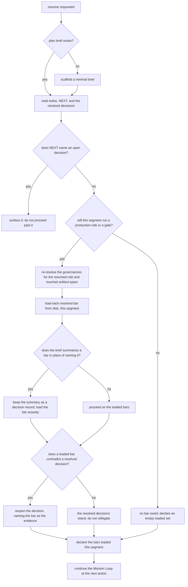

# mission/resume/ — pick a mission up from its plan brief, bars included

The **resume** behavior: read a mission's plan brief and continue the Mission Loop where it left off.
It is the read-back sibling of [`../checkpoint/`](../checkpoint/README.md) — checkpoint writes the
brief, resume reads it — and is enacted by the **`resume-mission`** skill. The brief is the state;
this node is the procedure that re-establishes a session from it.

## What

A mission runs as **segments**, one autonomous sitting each, and every segment after the first starts
by reading a brief instead of by being briefed. That works for **decisions**: the brief records what
was settled, and re-litigating settled ground is the waste resume exists to prevent.

It does **not** work for **bars**. A governance the first segment never opened leaves no trace in the
brief — the brief faithfully records what was decided and says nothing about what was never read — so
a later segment inherits the gap silently and can run an entire gate with no bar ever opened. The
skip does not surface; it **compounds**.

So resume separates the two: **decisions are reloaded from the brief, bars are reloaded from disk.**
A summary of a bar in the brief is a decision record — evidence of what a past segment concluded —
and is never accepted in the bar's place.

The mechanism is that the declared set is **re-derived from this segment's own resolution**, not
copied forward from the brief. That is what makes the skip observable, and it is worth being exact
about when: the declaration carries **no per-segment attribution**, so where the two sets happen to
coincide the artifact alone cannot tell a loader from an inheritor. What it *can* tell — and the only
case that matters — is the compounding one: an earlier segment that skipped bars recorded a
**smaller** set, and a segment that re-resolves declares the larger current one. The gap surfaces
exactly where it did damage, and nowhere else, which is why no attribution field is owed
(`../../authoring/spec-gate/README.md`).

**Non-goals.** It never checkpoints the mission (`../checkpoint/`), never dispatches one
(`../../gateway/dispatch/`), never retires one (`../../doctrine/plan-retirement/`), and never
ratifies a gate. It writes **no** `spec.md` frontmatter. It does not decide *which* bars apply —
that is the resolution matcher (`../resolution/README.md`); resume decides *that they are loaded
again, this segment*.

**Key terms.** A **segment** is one sitting within a mission's cycle. A **bar** is a governance the
resumed role is graded against. A **resolved decision** is a conclusion the brief records as settled.

## Use Cases

**Subject** — resuming a mission from its plan brief, and re-establishing the bars for the role the
resumed segment will run.

**Actors.** The **resuming session** — a conductor picking a mission up, in-session or headless — is
the only actor with a way in; it invokes both use cases, one after the other, in every resume. Two
parties are affected without invoking it: the **cold spec-judge**, whose pre-flight reads the
declaration this node produces, and the **human reviewer**, who reads the brief the session honors.
Neither invokes resume, so neither owns a row — the enumeration closes both ways
(`../../authoring/spec-format/README.md`).

| Use case | Actor / goal | Trigger | Inputs | Outcome |
|---|---|---|---|---|
| **resume the mission** | resuming session — continue where the last segment stopped without re-deciding what it decided | a session is asked to pick up a mission (`resume-mission`, or any session reading the brief) | the plan brief's `todos`, `## NEXT`, and resolved decisions | the next action identified and the working method reloaded; the loop continues |
| **re-establish the bars** | resuming session — be graded against bars it actually opened this segment | the resumed segment will run a production role or a gate | the resumed role + the artifact-types of the files the segment touches | governances re-resolved and each resolved bar **loaded this segment**, then declared in the segment's `governances_loaded` |

**Extensions** — the paths from those triggers that do not reach those outcomes:

| Use case | Cause | Outcome |
|---|---|---|
| resume the mission | no plan brief exists for the named mission | a minimal brief is scaffolded and the mission starts from it |
| resume the mission | `## NEXT` names an open decision or an unresolved open marker | the decision is surfaced and the segment does not proceed past it |
| re-establish the bars | the segment runs no production role and no gate | no bar is owed; the segment declares an empty loaded set rather than omitting the declaration |
| re-establish the bars | the brief **summarizes** a bar in place of naming it | the summary is kept as a decision record and the bar is loaded anyway |
| re-establish the bars | a bar loaded this segment contradicts a resolved decision in the brief | the bar wins: the decision is reopened, naming the bar as the new evidence |
| any | the brief's resolved decisions are neither contradicted nor reopened | they stand; the segment does not relitigate them |

**Surface trace** — every input this procedure exposes, against the use case that needs it:

| Element | Needed by | May not combine with |
|---|---|---|
| `PLAN_BRIEF` (the `.plan.md` path or the mission ref) | both | — |
| `RESUMED_ROLE` | re-establish the bars | — |
| `TOUCHED_ARTIFACT_TYPES` | re-establish the bars | — |

No pair on this surface is forbidden. `PLAN_BRIEF` and `RESUMED_ROLE` are the pair worth naming:
resume derives the role from the brief when it is not supplied, so supplying both is a narrowing of
an ambiguous case rather than a contradiction, and marking it forbidden would assert a guard nothing
enforces.

## Control Flow

## Bars are reloaded; decisions are not re-decided

The two halves pull in opposite directions and both are load-bearing, so the split is stated as a
rule rather than left to judgment:

- **A resolved decision is settled.** Reopen one only on new evidence, and say which evidence.
  Re-deriving settled ground is the cost resume was built to avoid.
- **A bar is never settled by having been summarized.** The brief may record what a bar was taken to
  require; that record is a past segment's reading, not the bar. Load the file.
- **When the two collide, the bar wins.** A resolved decision that contradicts a bar loaded this
  segment is reopened — and the bar is the new evidence the reopening names. This is the only
  self-correcting path a compounded skip has: the first segment that actually opens the bar is the
  one that discovers the decision was made without it.

The declaration is the checkable output. A resumed segment declares `governances_loaded` exactly as a
first segment does — same shape, same field, re-derived from this segment's resolution — so the
gate's pre-flight and its corroboration read a resumed segment on the same terms
(`../../authoring/spec-gate/README.md`). A resume is not an exemption from either, and it gets no
field of its own: the pre-flight already fails a declared set that omits an expected bar, so an
inherited stale set is caught by the check that exists rather than by a new one.

## Scenario map

| Edge | Path (Given) | Scenario |
|---|---|---|
| `B -- yes --> RD` | a mission whose plan brief exists | `a resume reads the brief's todos, NEXT anchor, and resolved decisions` |
| `B -- no --> SC` | a mission ref with no plan brief on disk | `a resume with no brief scaffolds a minimal one and starts from it` |
| `N -- yes --> N1` | a brief whose NEXT anchor names an open decision | `an open decision in NEXT stops the segment at that decision` |
| `N -- no --> P` | a brief whose NEXT anchor names no open decision | `a brief with no open decision continues to the next action` |
| `P -- yes --> G` | a segment that will run a production role or a gate | `a segment that will run a role re-resolves its governances` |
| `P -- no --> P0` | a segment that will run neither a production role nor a gate | `a segment owing no bar declares an empty loaded set` |
| `G --> L` | resolved bar candidates for the resumed role | `a bar the earlier segment never declared appears in this segment's declared set` |
| `S -- yes --> S1` | a brief that states a bar's rule instead of naming the bar | `a brief's summary of a bar does not stand in for the bar` |
| `S -- no --> S2` | a brief that names its bars without restating them | `a brief that summarizes no bar proceeds on the loaded bars` |
| `K -- yes --> K1` | a loaded bar that contradicts a decision the brief records as resolved | `a bar contradicting a resolved decision reopens that decision` |
| `K -- no --> K2` | a loaded bar that contradicts no resolved decision | `resolved decisions the bars do not contradict are not relitigated` |
| `D --> C` | a segment whose bars are loaded and declared | `a resumed segment declares the bars it loaded this segment` |
