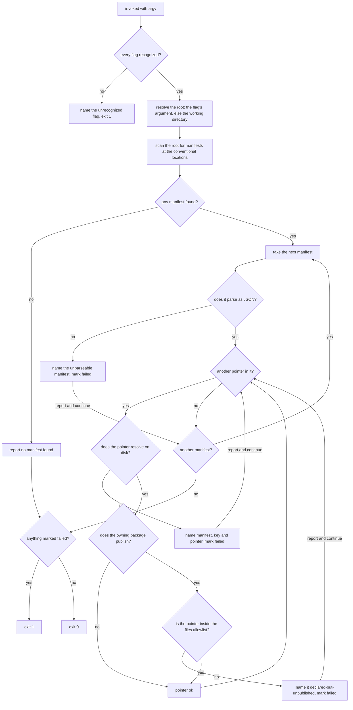

# check-plugin-manifests — no manifest declares a component the package does not ship

## What

A plugin manifest declares where its components live: `"skills": "./skills"`,
`"commands": "./commands"`, a list of agent files. A host runtime reads those pointers at install
time and loads what it finds. A pointer naming something the package does not ship is not caught by
anything the repo runs — the manifest is valid JSON, the schema is satisfied, the build copies the
key into each generated vendor manifest, and the defect only surfaces on a **user's** machine, after
publish, as a component the runtime cannot load.

**check-plugin-manifests** is the guard for that class. It reads every plugin manifest in the tree
and resolves each declared pointer against what the package actually ships, in the two ways a
component can fail to arrive:

| Sub-check | Answers | Blind to |
|---|---|---|
| **the disk check** | does the pointer resolve to a path that exists? | a path that exists but is excluded from the published package |
| **the publish check** | for a package that publishes, is the pointer inside its `files` allowlist? | a path listed in `files` that was never created |

Neither subsumes the other. A directory can exist and be excluded from the tarball; a `files` entry
can name a directory nobody created. Run either alone and one of the two ways ships.

**A pointer is any `./`-prefixed string value, not a fixed key list.** The manifest format grows new
component keys, and a guard hardcoding `commands` / `skills` / `agents` fails open on the next one
added. Every relative path in a manifest is a pointer to something that must ship, so the rule keys
on the value shape rather than the key name and covers a component key this node has never heard of.

**A pointer resolves against the plugin root, not the manifest's own directory.** A vendor manifest
sits one level down, in `.claude-plugin/`, and the pointer it spells `./skills` still names the <!-- spec-ref-ignore: an illustrative pointer literal, not a reference from this file -->
plugin's own skills directory. A
guard resolving relative to the file it just read reports every vendor manifest as entirely broken —
which is why the passing scenario deliberately spans both locations rather than testing one.

**Non-goals.** It validates no schema (that is the manifest's `$schema`); it does not check that the
declared component *works* once loaded, only that it arrives; it does not check that the manifest
itself is shipped; it writes nothing and fixes nothing it finds; and it is not a gate — a gate is a
judged verdict on one change request, while this is a mechanical check on the tree as it stands.

**Key terms.**

| Term | Plain meaning |
|---|---|
| **manifest** | a `plugin.json` at one of the conventional manifest locations |
| **canonical manifest** | `<plugin>/.plugin/plugin.json` — the hand-edited source the vendor copies are generated from |
| **vendor manifest** | a generated per-runtime copy (`.claude-plugin/`, `.codex-plugin/`) |
| **pointer** | a `./`-prefixed string value in a manifest, naming a path the package must ship |
| **publishable package** | the nearest `package.json` that is not `private` and declares a `files` allowlist |

## Use Cases

**Actors, and the goals they arrive with.**

| Actor | Goal (their result, not their call) |
|---|---|
| the author about to commit (person or agent) | know that no manifest points at something that will not ship |
| the pull-request check | reject a branch that introduced a dead pointer, with the guarantee the author had locally |
| the plugin author adding a component | be told they declared a component they have not created or not listed |
| **the plugin installer** — *affected, never invokes* | install a plugin that loads clean, with no missing-path warning |
| **the plugin's users after a rename or move** — *affected, never invokes* | keep every component the manifest promises, when a directory is renamed and one copy of the manifest is missed |

The last two are why the check runs over the **whole tree** rather than the plugin an author happens
to be editing. A dead pointer is written by one author and paid for by every installer, and the two
generated vendor copies are exactly where a hand-edit to the canonical source fails to land.

### UC1 — check every plugin manifest in the tree

| | |
|---|---|
| **Actor** | the committing author; the pull-request check; the plugin author |
| **Goal** | be told, before the change lands, if any manifest declares a component the package will not ship |
| **Trigger** | the repo's own check chain invokes the engine |
| **Inputs** | a root directory (defaults to the working directory) |
| **Outcome** | every manifest in the tree has had every pointer resolved against disk and, for a publishable package, against its `files` allowlist; the exit code is 0 only if nothing was found |

**Extensions**

| Cause | Outcome |
|---|---|
| a pointer resolves to no path on disk | names the manifest, the key, and the pointer; marks the run failed |
| a publishable package declares a pointer outside its `files` allowlist | names it as declared-but-unpublished; marks the run failed |
| the owning package is `private`, or declares no `files` | the publish check is not applied — nothing is published, so nothing can be omitted |
| a manifest does not parse as JSON | names it and marks the run failed — an unreadable manifest is escalated, never skipped |
| more than one pointer is dead | the run **reports every one** before exiting non-zero — one invocation reports every defect it can see |
| the tree holds no manifest at all | reports that plainly and exits 0 — a repo with no plugin is not a defect |
| a pointer is both absent from disk and omitted from `files` | reported **once**, as unresolved; the publish check is not also applied to it |
| no root is named | the working directory is the tree — the same check, over a different root |
| an unrecognized flag is passed | names it and exits non-zero, rather than falling through to a default |

### Surface trace — every element against the use case that needs it

| Element | Needed by | May not combine with |
|---|---|---|
| `--root <dir>` | UC1 — a caller checking a tree that is not the working directory | — |

**There is deliberately no report-only mode.** A findings-exit-zero default with an opt-in strict
flag is the shape [`../../corpus/spec-floor/`](../../corpus/spec-floor/README.md) was built to close:
the chain that forgets the flag reports green over a defect, and green is what the repo treats as
clearance to commit. A finding here is always a non-zero exit, so a chain cannot ask for the weaker
guarantee.

**There is deliberately no output-format element.** No actor above has a goal that needs machine
output; an element no use case needs is surface nobody asked for.

## Control Flow

One entry point, one graph. The two sub-checks are sequential on the same pointer: a pointer that
does not exist on disk is reported once and is not then also asked about `files`, because the
publish check would report the same missing thing a second way.

**Continuing past a finding is a decision, not a detail.** A guard that stops at the first dead
pointer reports one defect per invocation, so an author fixes a tree one run at a time. This one
sweeps every pointer of every manifest and reports the set. The exit code is unchanged either way —
only how much of the truth one run tells you.

**The publish check is conditional, and that condition is a branch.** A `private` package publishes
no tarball, so its `files` list constrains nothing and consulting it would manufacture findings
against packages that ship by another route entirely — which is how this repo's own plugins ship.

## Scenario map

### UC1 — check every plugin manifest in the tree

| Edge | Path (Given) | Scenario |
|---|---|---|
| pointer does not resolve on disk → name it, mark failed | a canonical manifest declaring a component directory that was never created | `a manifest pointer that resolves to nothing fails the check` |
| pointer does not resolve on disk → name it, mark failed | a generated vendor manifest, where the same defect sits one directory down | `a dead pointer in a generated vendor manifest is caught too` |
| pointer does not resolve on disk → name it, mark failed | a pointer under a component key outside the familiar set — **binds the value-shape rule against a guard that hardcodes a key list** | `a pointer under a component key the guard does not know is checked the same way` |
| pointer resolves → ok | a canonical manifest and a generated vendor manifest, both resolving — **convergence: the outcome does not vary with the manifest's location** | `pointers that resolve pass, whichever manifest location they sit at` |
| owning package does not publish → skip the publish check | a package declaring `private`, whose pointer resolves but whose `files` omits it | `a package marked private has its files allowlist left unread` |
| owning package does not publish → skip the publish check | a package not declaring `private` and declaring no `files` at all — **the second disjunct, where an absent allowlist means everything ships** | `a package that declares no files allowlist has its publish check skipped` |
| pointer outside the files allowlist → name it, mark failed | a package not declaring `private`, whose `files` omits the directory its pointer resolves to | `a package that publishes and will not ship a declared component fails` |
| pointer inside the files allowlist → ok | a package not declaring `private`, whose `files` names the directory its pointer resolves to | `a package that publishes everything it declares passes` |
| pointer dead on disk → short-circuit past the publish check | a pointer both absent from disk and omitted from `files` — the one path where both sub-checks could fire | `a pointer dead on disk is reported once, not again as unpublished` |
| manifest does not parse → name it, mark failed | a manifest file containing malformed JSON | `an unparseable manifest fails instead of being skipped` |
| another pointer → take the next | one manifest declaring two dead pointers — the inner loop | `every dead pointer within one manifest is reported` |
| another manifest → take the next | two manifests, each declaring a dead pointer — the outer loop | `every dead pointer is reported, not only the first` |
| unparseable → report and continue to the next manifest | an unparseable manifest sitting ahead of a manifest with a dead pointer | `the sweep continues past an unparseable manifest` |
| no manifest found → report plainly | a tree containing no plugin manifest | `a tree with no plugin manifest passes` |
| root resolved from the flag → scan that tree | the flag names a tree other than the working directory — **the positive companion to the flag guard below** | `the guard checks the tree it is pointed at, not the working directory` |
| flag not recognized → name it, exit 1 | an invocation carrying a flag the engine does not define | `an unrecognized flag fails loudly instead of being ignored` |

### The repo's own chain

The guard's promise to the installer is that **the chain guarding commits runs it**. That promise is
not kept by the engine alone — the chain has to invoke it — so the binding is a decision this node
owns and states, in the shape [`../../corpus/spec-floor/`](../../corpus/spec-floor/README.md) and
[`../../corpus/retired-terms/`](../../corpus/retired-terms/README.md) already use.

| Edge | Path (Given) | Scenario |
|---|---|---|
| the check chain invokes the engine | the repo's root package manifest | `the root check chain runs the manifest guard` |

## Delivery

Implemented by the **`check-plugin-manifests`** skill —
[`plugins/sdd/skills/check-plugin-manifests/`](../../../../../plugins/sdd/skills/check-plugin-manifests/)
— carrying a self-contained `.mts` script (the repo's node ≥23.6 / no-deps convention), in the same
shape as its sibling guards. It joins the root check chain as `check:plugins`, beside
`check-plan-safety`, `resolve-tracking` and `check-retired-terms`, so it runs on every `pnpm verify`
and in CI.

The CR that introduces it also **fixes the defect that motivated it** — the `aced` plugin's three
manifests each declare a `./commands` pointer to a directory that has never existed <!-- spec-ref-ignore: an illustrative pointer literal, not a reference from this file -->
— so the guard
ships live rather than inert. Sweeping the pointer rule over the whole tree before proposing it
measured every other manifest clean, so that is the only survivor to repair.

## Source

- The manifest's own shape (which keys a manifest may declare) is the packaging face of
  [`../`](../README.md); this node owns only whether what it declares will arrive.
