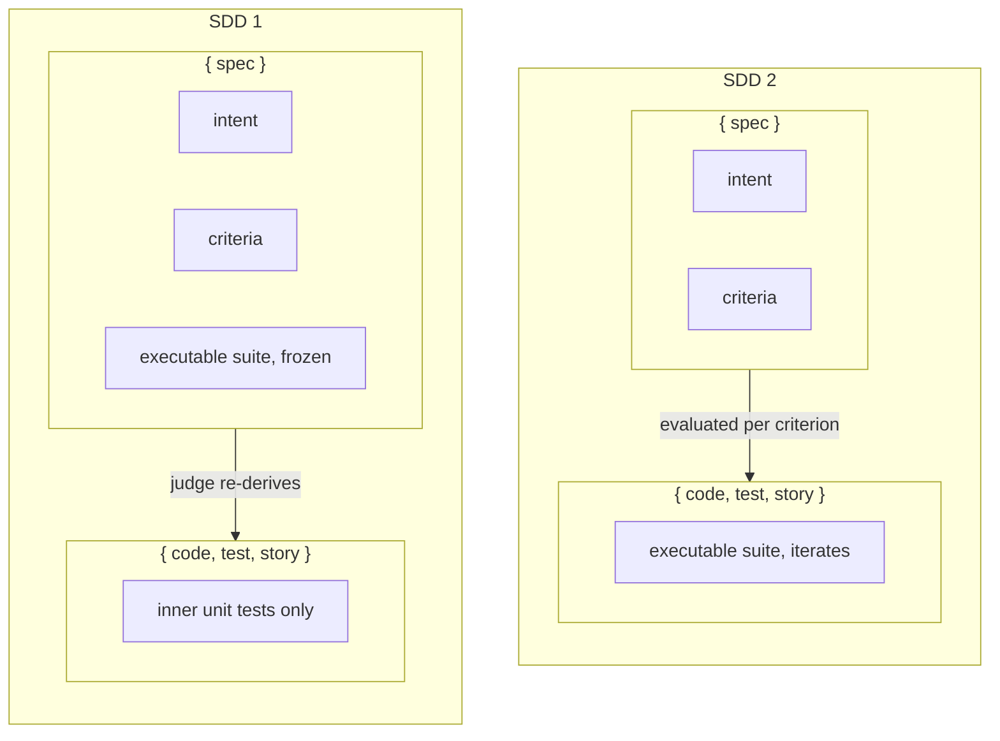
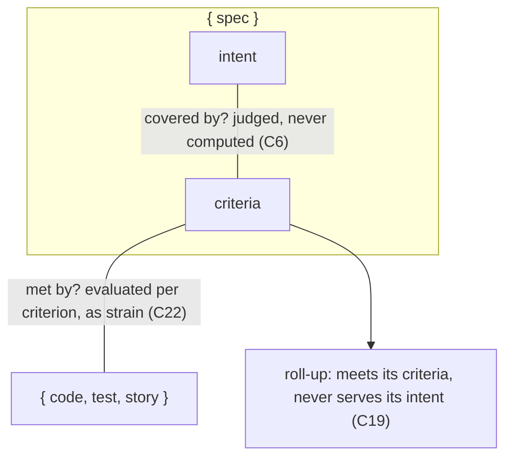
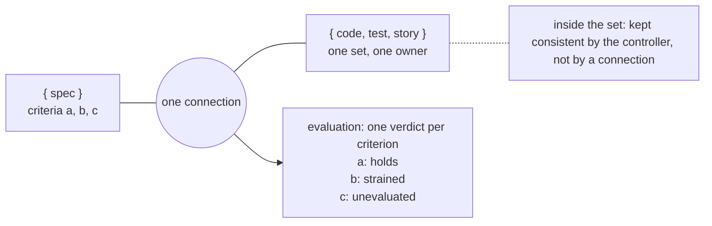
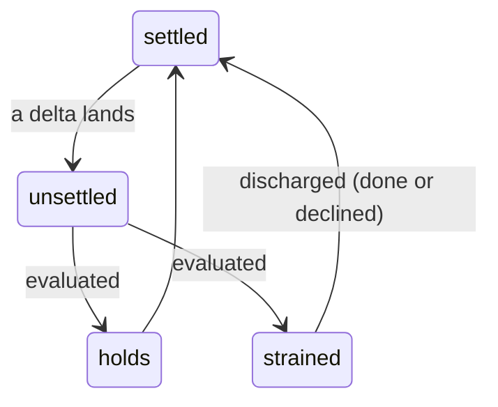
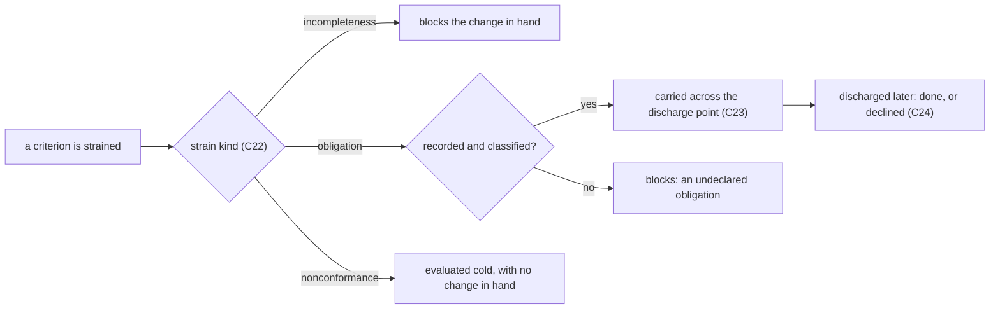
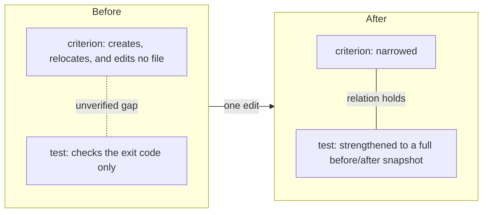
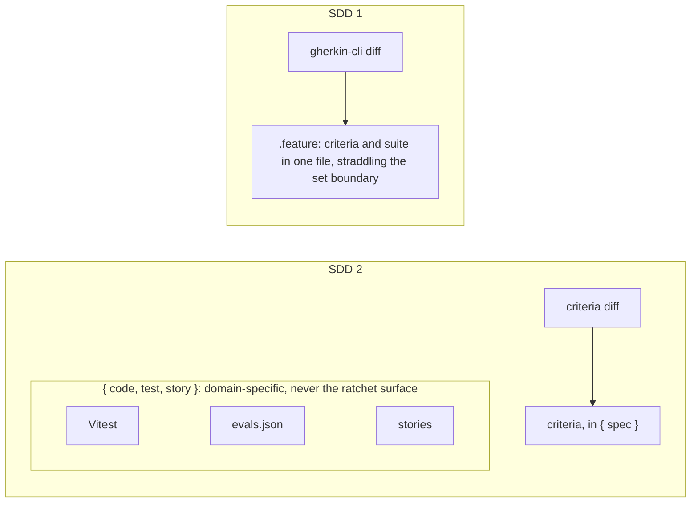
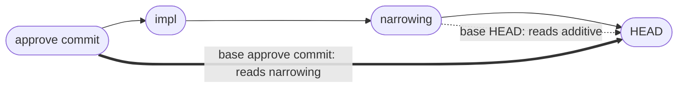
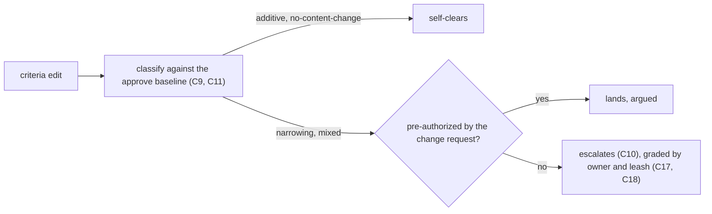
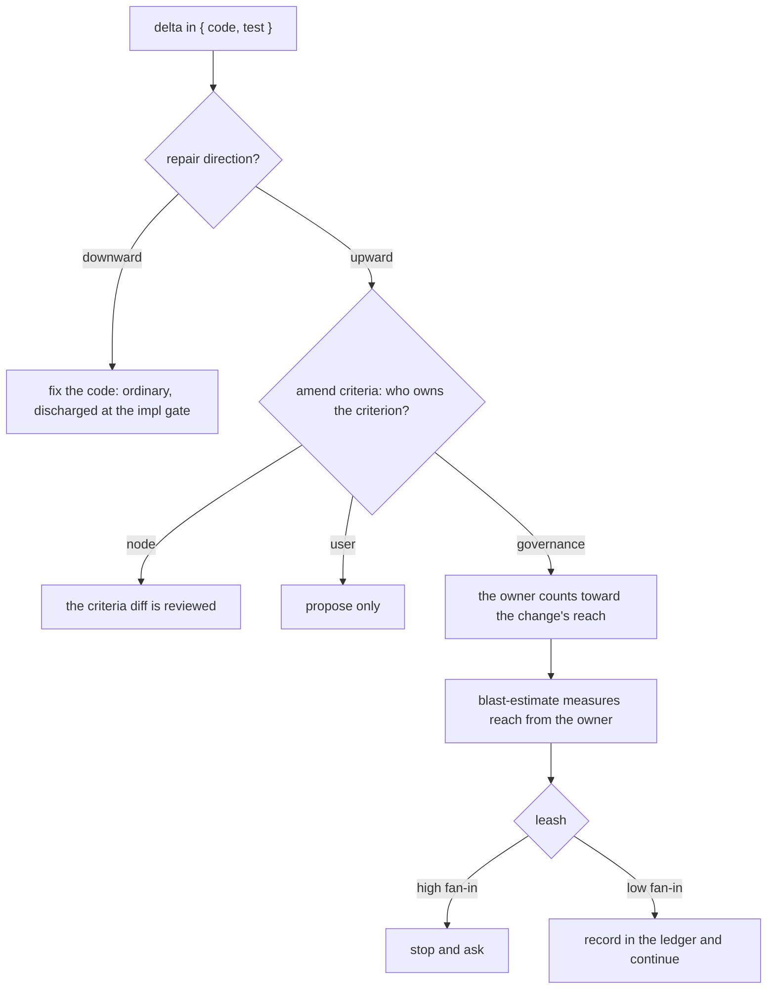

# criteria-governance: the SDD 2 criteria contract

**Status: `draft`. Not yet in force.**

This is a **cross-cutting governance**, not a node and not a project spec. It constrains how
every node in SDD 2 is specced, diffed, and gated, so it has no single capability owner and is
not colocated (C20). A governance runs **proposed → in force → retired**; `implemented` is
meaningless for a governance, because a governance is applied rather than built.

Evidence is in [`.research/validate-over-freeze/`](../../../../../.research/validate-over-freeze/conclusion.md).
Vocabulary is in [`GLOSSARY.md`](../../../GLOSSARY.md).

---

## Intent

Intent is argued with, not evaluated. Nothing in this section makes a claim a check could fail.
Aspiration belongs here and nowhere else, which is what stops it becoming a false `implemented`.

| | |
|---|---|
| **Purpose** | Let a project's specification run ahead of its code without lying about what is built, and let the executable suite iterate without ceremony. |
| **Frame** | SDD 2 is the **two-set instance** of the truss model: `{spec}` and `{code, test, story}`, one connection, discharge at the impl gate. |
| **Serves** | An agent amending a spec mid-mission; a producer whose implementation meets a criterion it cannot satisfy; a reader asking what a project actually guarantees today. |
| **Does not serve** | Replacing v1. The two coexist while this is built. SDD 2 re-implements none of v1's machinery for running a change from request to handoff. |
| **Direction** | Move checks from judged to computed wherever the same defect can be caught either way. |
| **Roles** | The **spec-producer** writes intent and criteria; the **spec-judge** grades them. The **impl-producer** reads the spec read-only and acts on `{code, test, story}`; the **impl-judge** re-runs the deterministic checks, grades the internal consistency of that set, and grades the criteria against the implementation. |

**Use cases are intent, not criteria.** v1 already chains
`## Use Cases → ## Control Flow → ## Scenario map → scenarios`: use cases name what the thing
serves and sit upstream of the evaluable end. That is why a backfill can draw the control-flow
graph from code
but must recover unserved use cases from request history. The source yields only the *served* use
cases by construction.

**What v1 leaves unmeasured.** One lifecycle flag on the root `spec.md` covers 46 feature files
and roughly 40 nodes; a node README carrying `status` fails closed by deliberate rule. And
`verify-scenarios`, the only mechanism where one side of a comparison is running code, is opt-in
through a `scenario-bridge.toml` that does not exist anywhere in this repository. The
`implemented` claim has never been checked against a suite. It is not wrong so much as
**unfalsifiable**, which is how two whole capabilities that v1's own spec describes sit inside it
with nothing built.

---

## Criteria

Each is a claim a check or a scenario could fail. Markers record how each is enforced and what
stands behind it. `computed` needs no agent. `tested` has trial evidence. `reasoned` has none yet.
`v1 has this` means the machinery already ships.

### A · Specification shape

**C1.** A node's specification is **intent + criteria**. Criteria live in `{spec}`. The
executable suite lives in `{code, test, story}`. *(tested)*

> Only the executable half crosses the boundary. ADR-0034 rejected moving the suite down because
> that direction deleted the criteria, leaving ADR-0016 nothing to re-derive from.

**C2.** Intent makes no evaluable claim. Aspirational detail belongs in intent and is never
expressed as a criterion. *(reasoned)*

> Nothing claims `campaign/` is built, so the lie has nowhere to form. This removes a lifecycle
> state rather than adding one.

**C3.** A criterion is **in force only from the approve event that records it**. Intent carries
no such event and incurs no obligation. *(reasoned)*

> Promoting intent into criteria is what takes on the debt. Two later criteria fall out of it. The
> approve event's commit is the baseline every criteria diff is measured against (C11), and a
> criterion with no approve event has nothing to narrow against, so drafting classifies as additive
> without needing an exemption (C10).

*Only the executable half crosses the boundary.* ADR-0034 rejected moving the suite down because
the direction it tested deleted the criteria, which left ADR-0016 nothing to re-derive from. Keep
the criteria in `{spec}` and the judge still holds an artifact the producer did not write.

**C31.** Whether the criteria **cover** the intent is re-judged once the intent has changed since
that judgment was last made. The trigger is computed by comparing the `## Intent` section at the
commit the approve event recorded against the working tree, **never from file timestamps**, and an
outstanding re-judgment is an **obligation** on `{spec}`. *(computed, reasoned)*

> Coverage itself cannot be computed (C6). Whether the judgment is *owed* can be, which is this
> document's stated direction applied to the one judgment that will never move. The baseline is
> already recorded for the ratchet (C11), so one ref serves both.
>
> Timestamps would not do even where they look convenient: git neither records nor restores them, so
> a fresh clone stamps every file with the checkout time and the check reads *not stale* forever.
> That is the green-that-means-unmeasured this document exists to prevent.
>
> It is also why intent and criteria stay in **one file**. The comparison is a section slice at a
> known commit rather than a file-level history query, so splitting them would save a little
> extraction and cost the oracle lens the ability to read both halves together: the computable step
> optimized at the expense of the judged one. The `## Intent` heading is therefore a contract the
> extractor depends on. Splitting for **placement** reasons (C20) is a separate decision.

*Only the lower relation is a connection.* Intent and criteria sit in one set, so their relation is
the controller's and carries no strain. That is why a green roll-up cannot mean the intent is
served, and why C31 computes when the judgment is owed rather than pretending to make it.

### B · Artifact-sets

**C4.** Artifact-sets are drawn by **agent responsibility**, which is truss's unit-of-change axis.
`{code, test, story}` is one set with one owner. *(reasoned)*

> Splitting code from test forces a traversal order: test-first is TDD, code-first reaches for
> what the code does and not for what it must never do. One set removes the question instead of
> answering it, which is ADR-0028's standing co-development doctrine.

**C5.** **Evaluation reports one verdict per criterion.** A set-level verdict is never a
substitute for them. *(reasoned)*

> The set is the unit of ownership; the criterion is the unit of evaluation. Coarse sets do not
> mean coarse reporting.

**C6.** Consistency *inside* a set is the **controller's** job, not a connection's. For
`{code, test, story}` that controller is the impl-judge's pass over the internal consistency of
`code ↔ test ↔ story`. For `{spec}` it is the spec gate's **oracle lens**, judging whether the
criteria cover the intent, and that judgment is **judged, never computed**. *(reasoned)*

> Strain is a property of a connection, and there are no connections inside a set. So a defect
> wholly inside `{code, test, story}`, such as code shipped without a test, is the controller's to
> catch and not the connection's. That is what removes the need for a second, separate pair of sets
> declared only to police coverage.
>
> `{spec}` holds both halves of a specification (C1), so intent ↔ criteria is the same intra-set
> case and is owned the same way. Intent is argued with rather than evaluated (C2), so no
> accumulation of satisfied criteria stands in for that judgment and no strain report can reach it.
> Naming the controller is what stops the coverage question being nobody's.

*The set is the unit of ownership; the criterion is the unit of evaluation (C4, C5).* One connection
joins the two sets, and evaluating it returns a verdict for each criterion it carries. There is no
connection inside `{code, test, story}`: keeping code, test and story consistent with each other is
the controller's job (C6).

### C · Connections and strain

A connection, the strain on it, and the move between the two are different things. C7 and C8 say
what a connection is. C22 says what it can be in. C25 and C26 say how it moves.

Separating them gives every term borrowed from truss a fixed home. Reconciling with that model
then becomes a question per layer, not per word.

**C7.** A connection is declared as a **relation that must hold** between two artifact-sets, not
as a rule that fires when one of them changes. *(reasoned)*

> Written as rules, a connection needs one rule for each end that can change: *when criteria
> change, regenerate the checks*, and *when checks change, validate them against the criteria*.
> Nothing makes those two rules agree. The same intended change runs the first rule when it starts
> at the criteria and the second when it starts at the checks, and the two can settle in different
> states. The outcome then depends on which end was edited first. That is exactly what
> **confluence** rules out: whichever artifact changes first, the result must be the same. The rule
> form loses it by design, before any particular connection is written.
>
> Written as a relation there is one statement, *every criterion has a check that establishes it*.
> Every repair restores that same statement, whichever end moved, so there is one place to settle.
>
> The vocabulary follows from the shape: a delta **unsettles** a connection, the connection is
> **evaluated**, the relation **holds** or strain is **raised**, strain is **discharged**, and the
> connection **settles**.

<figure>
<svg viewBox="0 0 980 420" role="img" aria-label="Written as rules needs one rule per end and the two ends can disagree; written as a relation both ends restore the same statement and land in one settled state." fill="currentColor" style="max-width: 100%; height: auto; font-family: sans-serif; font-size: 12px;">
  <defs>
    <marker id="c7-arrow" viewBox="0 0 10 10" refX="9" refY="5" markerWidth="7" markerHeight="7" orient="auto-start-reverse">
      <path d="M0,0 L10,5 L0,10 z" fill="currentColor" />
    </marker>
  </defs>

  <rect x="10" y="20" width="460" height="380" rx="12" fill="none" stroke="currentColor" stroke-opacity="0.35" />
  <rect x="510" y="20" width="460" height="380" rx="12" fill="none" stroke="currentColor" stroke-opacity="0.35" />
  <text x="240" y="48" text-anchor="middle" font-weight="600">Written as rules: one per end</text>
  <text x="740" y="48" text-anchor="middle" font-weight="600">Written as a relation</text>

  <!-- left panel: chain 1 (edit the criteria) -->
  <rect x="30" y="115" width="110" height="50" rx="6" fill="none" stroke="currentColor" />
  <text x="85" y="136" text-anchor="middle"><tspan x="85">edit the</tspan><tspan x="85" dy="14">criteria</tspan></text>
  <line x1="140" y1="140" x2="168" y2="140" stroke="currentColor" marker-end="url(#c7-arrow)" />
  <rect x="170" y="110" width="180" height="60" rx="6" fill="none" stroke="currentColor" />
  <text x="260" y="126" text-anchor="middle"><tspan x="260">rule 1:</tspan><tspan x="260" dy="14">regenerate</tspan><tspan x="260" dy="14">the checks</tspan></text>
  <line x1="350" y1="140" x2="388" y2="140" stroke="currentColor" marker-end="url(#c7-arrow)" />
  <rect x="390" y="115" width="60" height="50" rx="6" fill="none" stroke="currentColor" />
  <text x="420" y="145" text-anchor="middle">state A</text>

  <!-- left panel: chain 2 (edit the checks) -->
  <rect x="30" y="285" width="110" height="50" rx="6" fill="none" stroke="currentColor" />
  <text x="85" y="306" text-anchor="middle"><tspan x="85">edit the</tspan><tspan x="85" dy="14">checks</tspan></text>
  <line x1="140" y1="310" x2="168" y2="310" stroke="currentColor" marker-end="url(#c7-arrow)" />
  <rect x="170" y="280" width="180" height="60" rx="6" fill="none" stroke="currentColor" />
  <text x="260" y="296" text-anchor="middle"><tspan x="260">rule 2: validate</tspan><tspan x="260" dy="14">the checks against</tspan><tspan x="260" dy="14">the criteria</tspan></text>
  <line x1="350" y1="310" x2="388" y2="310" stroke="currentColor" marker-end="url(#c7-arrow)" />
  <rect x="390" y="285" width="60" height="50" rx="6" fill="none" stroke="currentColor" />
  <text x="420" y="315" text-anchor="middle">state B</text>

  <!-- left panel: the defect - nothing ties state A to state B -->
  <line x1="420" y1="166" x2="420" y2="284" stroke="#e11d48" stroke-width="1.5" stroke-dasharray="5 4" />
  <line x1="404" y1="166" x2="436" y2="166" stroke="#e11d48" stroke-width="1.5" />
  <line x1="404" y1="284" x2="436" y2="284" stroke="#e11d48" stroke-width="1.5" />
  <text x="230" y="219" text-anchor="middle" fill="#e11d48"><tspan x="230">nothing forces</tspan><tspan x="230" dy="15">A = B</tspan></text>

  <!-- right panel: two sources converging on one relation -->
  <rect x="530" y="115" width="140" height="50" rx="6" fill="none" stroke="currentColor" />
  <text x="600" y="145" text-anchor="middle">edit the criteria</text>
  <rect x="530" y="285" width="140" height="50" rx="6" fill="none" stroke="currentColor" />
  <text x="600" y="315" text-anchor="middle">edit the checks</text>

  <rect x="700" y="195" width="170" height="60" rx="6" fill="none" stroke="currentColor" />
  <text x="785" y="210" text-anchor="middle"><tspan x="785">restore: every</tspan><tspan x="785" dy="13">criterion has a</tspan><tspan x="785" dy="13">check that</tspan><tspan x="785" dy="13">establishes it</tspan></text>

  <line x1="670" y1="140" x2="698" y2="207" stroke="currentColor" marker-end="url(#c7-arrow)" />
  <line x1="670" y1="310" x2="698" y2="243" stroke="currentColor" marker-end="url(#c7-arrow)" />

  <line x1="870" y1="225" x2="888" y2="225" stroke="currentColor" marker-end="url(#c7-arrow)" />
  <rect x="890" y="200" width="60" height="50" rx="6" fill="none" stroke="#16a34a" />
  <text x="920" y="221" text-anchor="middle" fill="#16a34a"><tspan x="920">one</tspan><tspan x="920" dy="14">settled</tspan></text>
</svg>
<figcaption>Two entry points need two rules, and two rules can disagree; a relation gives both entry points the same statement to restore, so the settled state cannot depend on which end moved first.</figcaption>
</figure>

**C8.** **No connection declares a direction.** Direction is recorded on the repair, not on the
relation. *(reasoned)*

> Writing direction into a connection bakes in one workflow and makes every other traversal
> second-class. Amending criteria is as legitimate as amending code, which is why an upward repair
> needs an authority check rather than a prohibition.

**C22.** A strain is carried by **one criterion**, and is **exactly one** of three kinds.
**incompleteness**: the change is incomplete right now. **obligation**: the change created a debt
to discharge later. **nonconformance**: the criterion was evaluated cold, with no change in hand.
The kind decides what blocks; the size of the gap does not. *(reasoned)*

> The three need three different responses, and only incompleteness should stop the change in
> front of you. It is also why a gap *score* is the wrong instrument: the useful information is
> which kind, not how big.
>
> The kinds are exclusive, not three dimensions to score independently. They are distinguished by
> where the counterpart sits relative to the change in hand: both ends in it, the implementation in
> another change, or no change at all. A connection can still carry several strains at once, one
> per criterion (C5), which is the only place a mixture is meaningful.
>
> The kind therefore belongs to an evaluation and not to the criterion. The same failing criterion
> is an incompleteness when swept in a change touching both ends, and a nonconformance when swept
> cold. Each name states the defect, so that none of them reads as a property to be scored.

**C23.** **Obligation strain may be carried** across a discharge point when it is recorded and
classified. Incompleteness strain may not. An implementation is complete when incompleteness
strain is zero and **no obligation is undeclared**. *(reasoned)*

> v1 pins obligation to zero at the impl gate, which is the waterfall policy and the strict one.
> That leaves a legitimately carried debt nowhere to sit, so aspiration goes underground and
> reappears as a false `implemented`. This states the injury as a policy rather than as a bug.

**C24.** **Declining is a legal discharge.** An obligation may be discharged without being done, on
the record. *(reasoned)*

> Without it any report nags forever, and an accumulating gap count is one everyone learns to
> ignore. `campaign/` and `forge/` may well be legitimate declines; today there is nowhere to say
> so.

**C25.** **Discharge is defined once per connection**, and applies whichever end the delta landed
on. *(reasoned)*

> This is C7's transition half, stated separately so C7 stays about what a connection *is*. It also
> uses the vocabulary rather than paraphrasing it: restoring a relation *is* discharge, and what
> follows is the connection settling.

**C26.** Evaluating a criterion yields exactly one of: **holds**; **strained**, typed per C22;
**unevaluated**, meaning no check binds to it; or **declined**, per C24. **`unevaluated` never
reports as `holds`.** *(v1 has three of the four; reasoned)*

> C5 says one verdict per criterion; this says which verdicts exist. v1's bridge already returns
> PASS / FAIL / UNBOUND, and truss independently recorded that two states are not enough: *"the
> `.github` repo does not score as unstrained, it scores as never-checked, and reporting those two
> the same way is exactly the defect that let the merge through."* Two projects reached the same
> three-state requirement separately, which is the strongest evidence in the set for any criterion
> marked *reasoned*.

*`unsettle` is outcome-neutral.* It says the relation is no longer known to hold, not that it broke.
Strain is raised only after evaluation finds the relation broken, which is why "the delta raises
strain" prejudges an evaluation that has not happened yet. `unsettle` is the inverse of truss's own
*settles*.

*The kind decides what blocks, and only incompleteness stops the change in front of you.* An
obligation may cross the impl gate, but only once it is on the record, which is what keeps
`implemented` from being claimed over work that was never built.

### D · The ratchet

**C9.** The edit classifier points at **criteria**, not at the suite. Every criteria edit is
classified `additive` / `no-content-change` / `narrowing` / `mixed`. *(v1 has this, on the suite; reasoned)*

> Criteria stay in one set and one format; suites are domain-specific. Pointing at criteria means
> one classifier covers Vitest, `evals.json`, Storybook and prose, with no per-suite differ to
> build in any domain.

**C10.** A criteria edit classified `narrowing` or `mixed` against its approve baseline
**escalates, and is never silently absorbed**, unless the change request pre-authorized that
narrowing. `additive` and `no-content-change` self-clear. *(v1 has the detector; tested)*

> A criterion with **no approve baseline has nothing to narrow against**, so authoring before
> approval classifies as additive by construction and the drafting phase needs no special case.
> Pre-authorization is what keeps a deliberate narrowing cheap: declare it in the change request
> and it is argued, not ambushed.
>
> v1 ships this detector and this routing, but fires it only while the file still carries a
> `@frozen` tag written at approval. v2 has no such tag. It gets the same signal from the commit
> the approve event recorded, so the condition changes and the detector is reused as it stands.

**C11.** The classifier's baseline is **the commit recorded by the approve event**, never the
working head. *(computed, reasoned)*

> Frozen-ness becomes derived rather than stored, which is ADR-0017's own rule, and the
> moving-baseline leak closes in the same stroke. v1's ledger `gate` line already carries the
> verdict and what it froze; it needs the ref. **Risk to carry: a squash or rebase orphans it.**

*Every local measure improves while the contract shrinks.* The test really did get better: a full
before/after content snapshot replaced a bare exit code. But it is a stronger check of a smaller
claim. Afterwards the relation holds perfectly, so evaluating the state alone reports nothing
wrong. Only a diff of the criteria against their approve baseline sees the coverage that was lost.

*One classifier, because criteria stay in one place and one format.* `gherkin-cli diff` worked
because the `.feature` was both artifacts at once. What made it work was that criteria carry stable
identity and structure (C21), not that they were Gherkin. Point the classifier at criteria and the
suite's format stops mattering.

*Freezing as a recorded boundary, not a stored tag.* A narrowing that landed in an earlier commit
becomes invisible to a diff against the working head, because by then it *is* the head. The ledger
`gate` line already records the verdict and what the approval froze; adding the commit ref makes
frozen-ness derived rather than stored, which is ADR-0017's own rule.

**C12.** **Invariant-suite backstop.** A change that adds behavior while its suite stays invariant
to that behavior has specified nothing. *(computed, tested)*

> Stated independently by three of four judges. Computable from a diff plus a coverage run.

**C13.** A criteria relaxation that **verification would not have caught must carry a recorded
argument**. Run the before-suite against the after-implementation; if it still passes, nothing
compelled the edit. *(computed, tested)*

> It does not prove bad faith. It proves the edit was invisible to verification, which is the
> class of change that has to be argued rather than presented as necessity.

**C14.** A criterion that **forbids** something requires a check that **fails when the forbidden
thing happens**. This holds regardless of the change's reach. *(v1 has the check; tested)*

> Absence of the forbidden thing from a fixture is not evidence it would be ignored if present.
> v1 ships this check but keys it to reach alone (how much of the project a change disturbs) and
> lets a low-reach change skip it, which
> is why the one trial miss was within the rules rather than a judge error. Detection is
> mechanical: a negation in the criterion's assertion clause.

**C15.** An **intended edit that yields zero delta is an error**. A zero-delta change raising
nothing stays the rule; the inverse must be surfaced. *(computed, tested)*

> The false green on the authoring side: report and reality disagree and nothing detects it. This
> produced the worst defect in the trials themselves, twice.

**C16.** Criteria judgment runs **N > 1 and fails closed on disagreement**, never majority vote. *(tested)*

> 3-of-4 is unreliable at the N=1 a gate actually runs at. ACED already carries this discipline.

**C21.** Every criterion carries a **stable identity**, independent of its wording and of its
position in the document. *(v1 has this; reasoned)*

> Without one a classifier cannot tell a *modification* from a *removal plus an addition*, and a
> line-diff is fooled outright by content moved between adjacent criteria. v1 warns about exactly
> that case and keys on the scenario name or an explicit id rather than on lines. **C9 is
> unbuildable without this.**

*Three criteria, one pipeline.* C9 says what is classified: criteria, not the suite. C11 says what
it is classified against: the approve commit, not the working head. C10 says what each class does.
A criterion with no approve baseline has nothing to narrow against, so drafting is additive by
construction and needs no exemption.

### E · Authority

**C17.** Every criterion carries an **owner**: `node`, `user`, or `governance`. *(v1 has one owner; reasoned)*

> v1 froze a suite at approval, which did two jobs at once. It stopped the contract weakening
> silently, and it made removing anything an escalation. Reviewing the diff replaces the first job
> and not the second: a judge reading a diff cannot tell that a criterion was inherited from a rule
> the node does not own. v1 has the shape already in `@pinned`, which marks a scenario as the
> user's, but it recognizes only that one owner.

**C18.** An upward repair on an **inherited** criterion is scoped to that criterion's **owner**,
so the change's reach is measured from the owner rather than from the node. Autonomy is graded on
that reach. *(v1 grades on reach; reasoned)*

> Graded, not floored. A blanket prohibition rebuilds v1's rigidity at a smaller scale. v1 already
> measures reach as dependency fan-in and already grades autonomy on it, so scoping to the owner
> makes both grade this unchanged, with no second autonomy bar. It also fixes a case v1 reads too
> low: a leaf tool retiring a corpus-wide rule touches almost nothing, so reach comes out small
> while the consequence is corpus-wide.

*No second autonomy bar.* `blast-estimate` already measures dependency fan-in and the leash already
grades on reach. Scoping the repair to the owner rather than the node makes both grade it unchanged.

### F · Placement and lifecycle

**C19.** A **project spec carries no `status`**. Lifecycle belongs to the change request; a
project's state is the derived roll-up over its criteria, and **the roll-up states what it
answers**: that the implementation meets the criteria in force at a named baseline, never that the
project serves its intent. *(computed, reasoned)*

> Three of v1's four values belong to a change request rather than a project. A living project is
> permanently `draft`. A whole contract does not `approve`. And `implemented` is momentarily true
> at best, which is the value that went false. Only `deprecated` is genuinely project-level and deserves its own field. Under
> per-criterion evaluation the aggregate is derivable, so storing it is the stored-derived-fact
> ADR-0017 removed `aligned` for.
>
> The roll-up is the artifact most likely to be read as the whole truth, so it carries its own
> scope. This is C26's rule one level up: there, `unevaluated` never reports as `holds`; here,
> *covers its criteria* never reports as *serves its intent*.

**C20.** A **cross-cutting contract is a governance, not a node**, and is not colocated, because it has
no single subject. A governance with one capability owner colocates with that capability. *(v1 has this; reasoned)*

> v1 already draws this line. Its cross-cutting home holds the governances with no single
> capability owner, and a governance that has one lives in that capability instead. Organizing by
> capability (screaming architecture) has no place to put a rule that spans all of them, which is
> why ADR-0034's colocation does not reach this document.

### G · Producing a spec

**C27.** Before a spec reaches the gate, the **spec-producer re-reads it as a cold reader** and
rewrites whatever resolves only with the authoring context. *(reasoned)*

> A governance is read cold by definition; that is what makes it cross-cutting. Every defect this
> pass exists to catch was found by a reader who had not been in the conversation, and every one of
> them was invisible to the author who had. Five criteria in this document needed it.

**C28.** A criterion **resolves without its authoring context**: it states what must be true of its
own subject rather than what was wrong with a predecessor; every term it introduces is defined
where it is named; every pronoun has one unambiguous antecedent; and no term carries a second sense
elsewhere in the document. *(reasoned)*

> Each clause is a defect this document shipped. C10 read "not only on a `@frozen` file", which is
> a predecessor's defect and unusable to a reader who does not know that predecessor. C14 and C18
> named a predecessor's mechanisms instead of stating the requirement. C7 used "never as a handler"
> without the contrast that gives it meaning, and "restoring it" with an antecedent that read as the
> wrong noun. C22 named three strain types and left the mapping to be inferred. A group label read
> "Sets" in a document that also uses criteria set, touch-set and root set.

**C29.** A criterion that **paraphrases defined vocabulary** either uses the term or is missing a
criterion. Determine which; do not leave the paraphrase standing. *(reasoned)*

> The highest-yield check in the pass, because a paraphrase is a structural symptom rather than a
> wording defect. "Restoring the relation is defined once" was discharge written as prose, and
> following it found an entire missing layer: the transition rules that became C25 and C26.

**C30.** A **count or claim a document makes about itself is derived when written**, never recalled. *(computed, reasoned)*

> This document twice stated a marker tally from memory and was wrong both times, and a third
> attempt by `grep` over-counted on a prose mention of the very word being counted. A
> self-describing number is a claim like any other, and it is checkable at zero cost.

---

## Still open

- **The attentive posture is assumed.** Every judge that caught a ratchet-down was *asked* to
  review a change, which is the posture a narrowing is routed into. It is not the posture of a check that
  has been routed nothing, and per C10 that is what an unrouted criteria edit gets.
- **Twenty-four of thirty-one are reasoned, not measured.** All of groups A (bar C1), B, C, E, F and
  G, plus C9, C11 and C21. No trial has diffed criteria that are not Gherkin, put an inherited
  criterion in front of a judge, or carried an obligation across a gate.
- **Coverage of intent has no loop running it.** C6 names the controller and C31 says when the
  judgment is owed, but nothing runs it continuously. v1 specifies that loop — `campaign/`, the
  Oracle's — and it is one of the two capabilities that are specified and unbuilt. Its absence is
  invisible for the reason under discussion: no criterion is strained by the absence of the loop
  whose job is to notice missing criteria.
- **Generalization.** One subject, and the easy one: a small, deterministic, already-colocated
  tool, at N=2 and N=3 per corrected pair.

ADR-0034 stands unamended, deliberately. Its evidence is not overturned. Its premise is, and only
for the arrangement that keeps criteria in the spec set.
