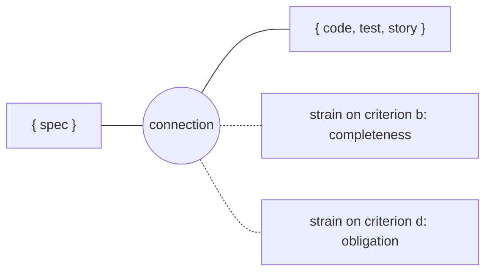
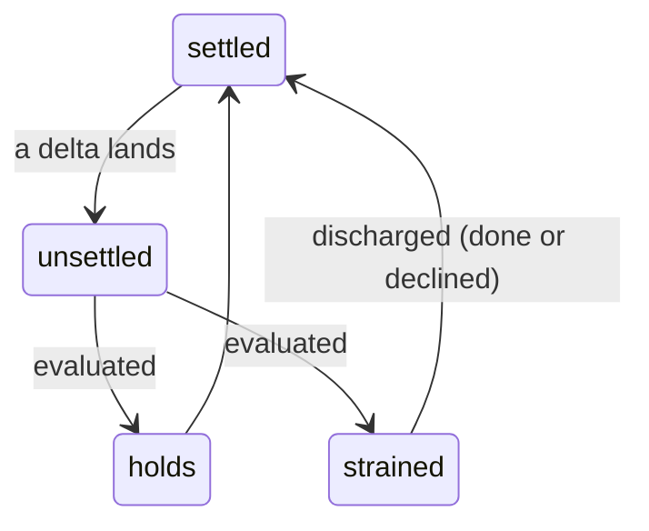
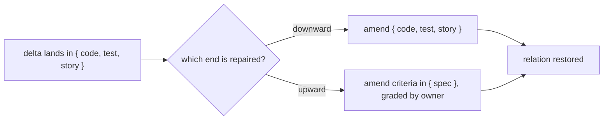

# Glossary: SDD 2 ubiquitous language

SDD 2 is the two-set instance of the [truss](https://github.com/cyberuni/cyber-truss) model.
Most of this vocabulary is inherited from that model rather than coined here. Terms marked
*(SDD 2)* are ours. The rest are truss's, and must not drift from it.

This is not `.agents/specs/sdd/glossary.md`. That file holds v1's ubiquitous language, and v1 does
not speak this one.

## The two nouns

Truss's own glossary invites the confusion between these, so start here (see
[Upstream](#upstream)).

**connection**: a relation between two artifact-sets that must hold. Undirected, declared once,
and standing. A connection is never consumed. It survives every evaluation and every discharge.

**strain**: the state of a connection whose relation does not hold for a given criterion. A
condition, not a thing. Typed `completeness`, `obligation`, or `conformance` (C22). Evaluation
raises it and discharge removes it. The connection remains either way.

A connection is not a strain. Discharge is the quickest test between them: it removes the strain
and leaves the connection standing.

There is a second test. One connection carries many criteria, and evaluation returns one verdict
per criterion (C5, C26), so several independent strains can sit on one connection at once. That
makes no sense if a strain is a kind of connection.

One connection, two strains on it at once. Discharging either strain removes that strain; the
connection is still there.

## The connection lifecycle

Each step has one verb, and none of them makes the connection an actor. A connection states a
relation that must hold. It is never a handler and never a trigger. A handler needs one rule for
each end that can change, and nothing makes those rules produce the same result. The settled state
would then depend on which end moved first, and that is the loss of **confluence**.

> A change to `{test}` **unsettles** the `{spec} ↔ {test}` connection. The connection is
> **evaluated**. Either the relation **holds**, or **strain is raised**. The strain is
> **discharged** at a discharge point, and the connection is **settled**.

**unsettle** *(SDD 2)*: what a delta does to a connection. The connection is no longer known to be
settled, so it must be evaluated. The word is outcome-neutral on purpose: it does not claim the
relation broke, only that the question is open. It is the inverse of truss's *settles*.

**evaluate**: what is done to a connection to learn whether its relation holds. The subject of the
active verb is always the evaluator (a controller, a check, a judge), never the connection.

**holds** / **strained** / **unevaluated** / **declined**: the four verdicts evaluation can return
(C26). `unevaluated` never reports as `holds`.

**raise**: what a delta does to strain, once evaluation has found the relation broken.

**discharge**: resolving strain, at a point the workflow names.

**settle**: the state a connection returns to once discharged.

**confluence**: the guarantee that the settled state does not depend on which artifact was changed
first. Truss states it as *"whichever artifact you change first, the repository settles into the
same state."* It is the reason a connection is written as a relation rather than as rules: two
rules, one per end, can settle in two different places.

## Repair

**repair direction** *(SDD 2)*: which end of a connection a repair is made on. It is a property of
the repair, never of the connection. Connections are undirected, and direction belongs to wherever
the delta landed. Amending criteria restores a relation as legitimately as amending the
implementation, which is why an upward repair needs an authority check rather than a prohibition.

**downward repair**: the delta landed in `{code, test, story}`, and the repair is made there too.
The ordinary case.

**upward repair**: the delta landed in the implementation set, and the repair is made on `{spec}`
by amending criteria. Legitimate, and also the shape a ratchet-down takes. That is why it must be
graded rather than waved through.

Both repairs restore the same relation. The connection does not prefer either one; the grading on
an upward repair is about who may amend a criterion (see *owner*), not about direction.

## Owner

**owner** *(SDD 2)*: who may amend a criterion. Three values.

- **node**, the default. The node's producer may amend it, subject to review of the criteria diff.
- **user**, which is v1's `@pinned`. Propose only, and never execute without in-session
  authorization.
- **governance**, inherited from a cross-cutting rule the node does not own.

**upward-repair scoping rule** *(SDD 2)*: an upward repair on an inherited criterion counts the
owner among the areas the change touches. Reach is then measured from the owner rather than from
the node, and the leash grades on that reach. A corpus-wide governance reads high, which narrows
the leash to stop-and-ask. An owner little else depends on reads low, and the agent records its
decision and continues. No second autonomy bar, and the grading is computed rather than judged.

## Terms borrowed from v1

SDD 2 reuses machinery that already ships in v1, so its criteria name it. These entries exist so a
reader who has not worked in v1 can resolve those references. They describe v1 as it stands, not
what SDD 2 requires of it.

**node**: one unit of a project spec, covering one capability. A node holds prose and, when it
specifies behavior, criteria.

**spec gate** / **impl gate**: the two points a change passes through. The spec gate grades the
spec and its criteria before implementation starts. The impl gate grades the implementation
against those criteria.

**change request**: one bounded unit of work against a project spec, with its own lifecycle. It is
what carries `draft`, `approved` and `implemented` in SDD 2 (C19).

**reach**: how much of a project a change disturbs. v1 computes it as dependency fan-in and calls
the computation `blast-estimate`.

**leash**: how far an agent may act without asking. v1 derives it from reach at the start of a run.
Inside the leash the agent records its decision and continues, and outside it the agent stops and
asks.

**ledger**: the durable, append-only record beside a project spec. A `gate` line in it records an
approval: the verdict, and what that approval froze.

**`@frozen`**: a v1 tag written onto a suite file when the spec gate approves it. It marks the file
as a settled contract, and v1's narrowing escalation fires only while it is present. SDD 2 has no
such tag and takes the same signal from the approve commit (C10, C11).

**`@pinned`**: a v1 tag marking one scenario as the user's. An agent may propose a change to it but
never make one without in-session authorization. It is the single-owner ancestor of C17's owner.

**`campaign/` and `forge/`**: two capabilities described in v1's own project spec for which no
implementation exists. They sit inside a project marked `implemented`, which is the defect this
governance exists to prevent.

## Terms deliberately not used

| Term | Why not |
|---|---|
| **trigger**, **handler**, **fire** | A connection states a relation that must hold. Procedural framing needs one path per direction and loses confluence. Use *unsettle* for the occasion and *evaluate* for the act. |
| **raises strain** *for the occasion of an evaluation* | Prejudges the outcome. A delta unsettles a connection. Strain is raised only once evaluation finds the relation broken. |
| **direction** *on a connection* | Direction belongs to the repair, not the relation. See *repair direction*. |
| **approve** *for the autonomy bar* | `approval` is the gate event (`approval.<gate>: { verdict, by }`). The **leash** is the latitude. Two distinct things, both load-bearing. |

## Upstream

Two items belong in truss's own model glossary rather than here.

**repair direction** is a general model term, not an SDD-specific one. It is recorded here because
this is where it was coined.

**strain is a condition, not a connection.** Truss defines it as *"a connection whose relation does
not currently hold"*, which reads as making strain a kind of connection. Every other use in truss
treats it as a condition. Strain is *raised*, *carried across a crossing*, and *discharged*. A
connection does none of those, and survives all of them. SDD 2 uses the condition reading, and C5
and C26 require it.
